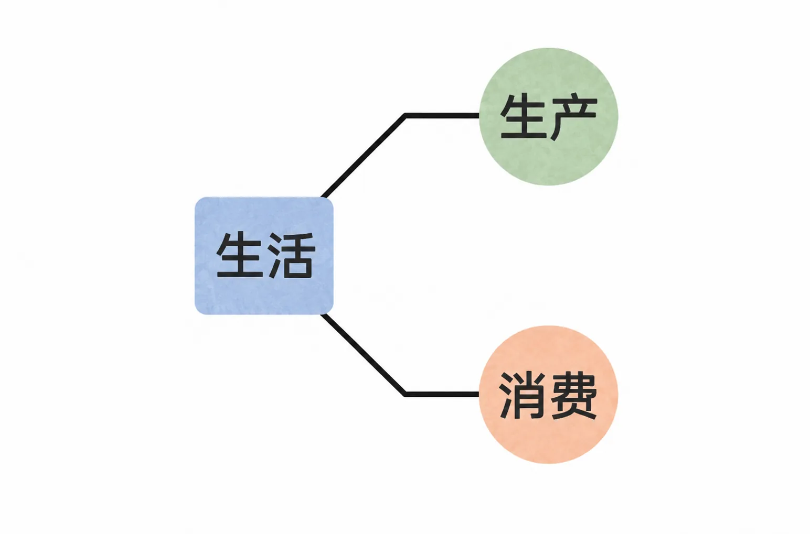
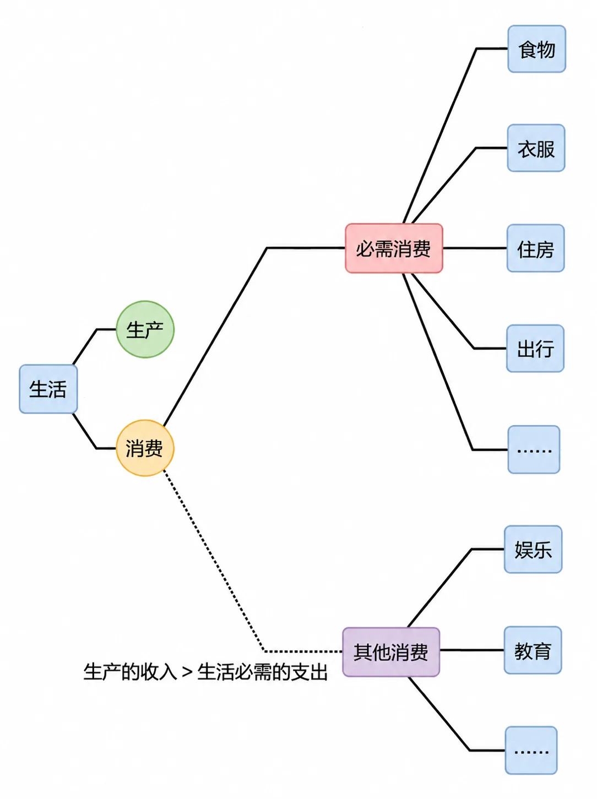
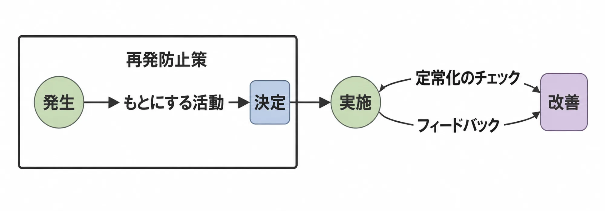

# 财富的唯一正常来源

钱本身并不一定可以被称为财富。小朋友手里拿的，通常被称作零钱，因为数量很少；大多数人有的，被称为积蓄；只有少数人才有所谓的财富——钱的金额得足够大。这样，钱才可以被称为财富，或者在投资或创业的时候被称为资本。

因此，积累是把钱变成财富的唯一正当手段。关键在于，积累肯定耗费时间，并且常常是很长的时间。

钱，又是从何而来的呢？

为了思考方便，也为了思考得深入且高效，让我们先做一个假设：我们生活在一个完美的社会中。在这里，每个人都安居乐业，即每个人都可以安全生活、平等交易、放心生产、自负盈亏。

在这个完美社会里，坑、蒙、拐、骗、偷、抢，显然都是不可以的。于是，每个人都一样，只能靠自己生产的商品或者服务，通过交换获得钱，再通过积累把钱变成财富。

这里的关键在于，所有人都一样，天生就是消费动物，时刻都得满足“生活必需”，否则就无法生存。

所以，所谓的生活，从本质上来看，就只有两个组成部分：生产与消费。

*生活的两个组成部分：生产与消费*

生活中的消费，除了维持生存的必需消费之外，还有其他消费，比如娱乐和教育。其他消费可以存在的理由，只能是生产的收入大于生活必需的支出。

这里需要做一个判断。无论是生产还是消费，都需要时间。如果非要分出先后顺序的话，只消费不生产，肯定不行；只生产不消费，也不可能。

那么请问，究竟是应该先生产再消费呢，还是先消费再生产呢？

*先生产再消费，还是先消费再生产？*

好像只有小朋友才可以理直气壮地只消费不生产。

成年人肯定不行，成年人哪怕先消费再生产，实际上也并不可行，因为那只能是一厢情愿。

于是，道理很清楚：在正常的世界里，财富的终极来源，只能是生产，这也是财富唯一的正当来源。

首先要先生产再消费，并且生产收入要大于必需消费的支出，才可能有积累的机会；而且还需要持续生产，再加上足够的时间，钱才有可能成为财富。

积累的真正难度在于时间要足够久。反过来讲，就是必须时间够久才可能产生有效积累。

然而绝大多数人失败的核心原因，并不是不从事生产，也不是从不积累，而是因为都没做到时间足够久的积累，所以钱的金额不够大，因此才没有获得或者掌握真正的财富。

甚至，即便是在不完美的世界里也一样，人们更多还是因为同样的原因失败，而不仅仅是因为现实“不完美”或者“不公平”。

再次强调，财富的唯一正常来源只能是生产，别无其他。

再进一步，实事求是地说，我们的结论趋向一致：生活就应该以生产为中心。其他的无论是什么，都得排在其后，没有什么比生产更为重要——起码，在生活必需得到满足之前。

*生活应以生产为中心*
