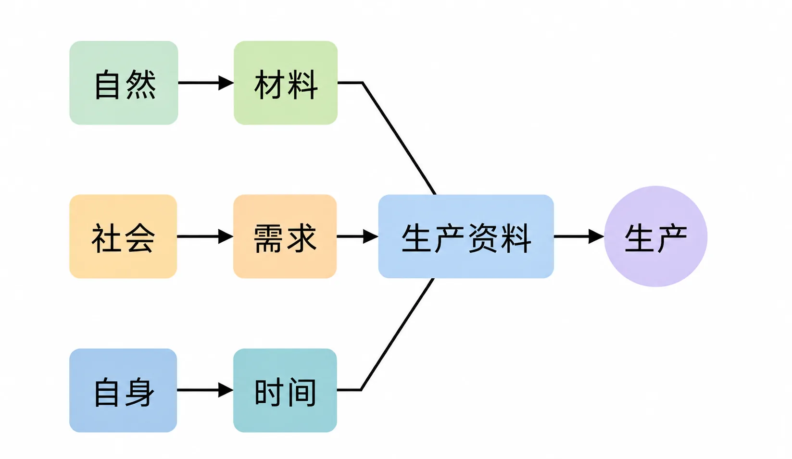
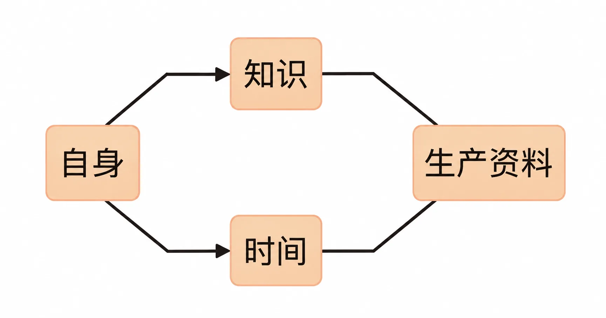
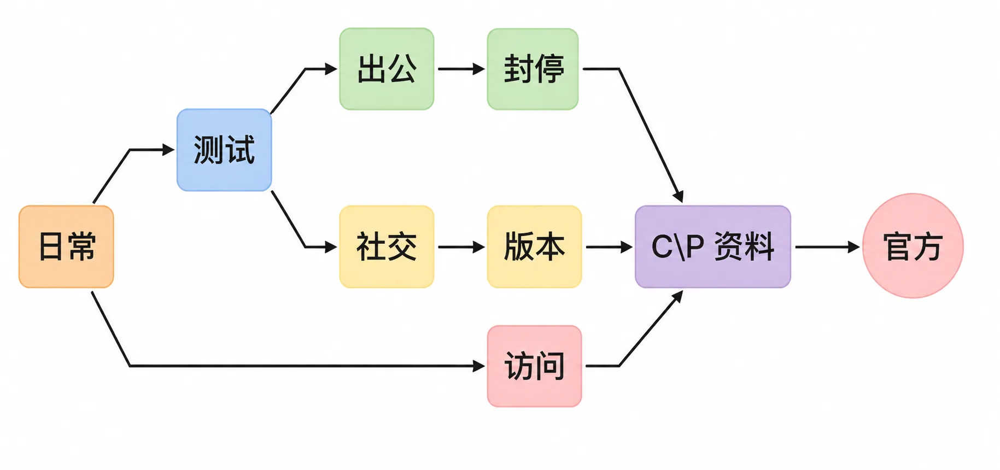
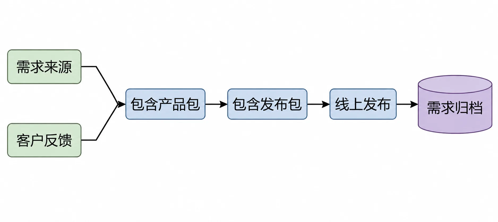
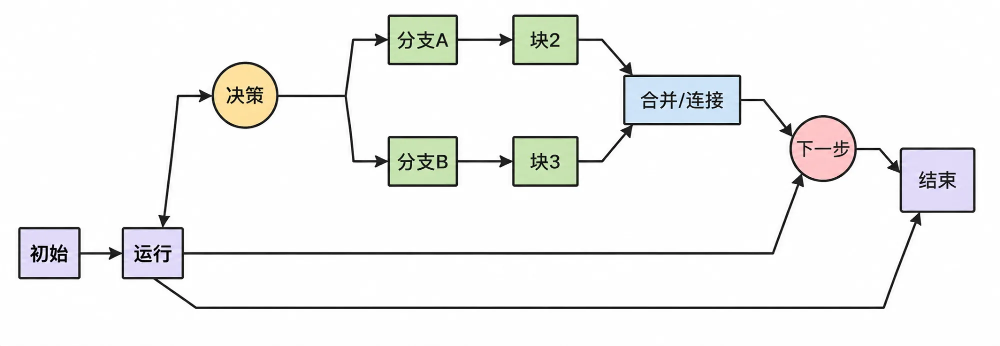

# 生产资料的终极来源

我们再来看看这三种生产资料的来源，材料来自自然；需求来自社会；而时间呢？花的当然是生产者自己的时间。

换言之，为了生产，我们需要向自然索取材料，在社会中寻找需求，而后用自身的时间去完成。

再细想，向自然索取材料并不是谁都可以做到的事情，也不是谁天生就会的事情。能做到这件事，需要知识。知识从哪里来的呢？自己学来的。不学习就不知道什么有用，不学习就不知道到哪里去找什么东西，换言之，为了生产，我们得向自己索取知识。

再进一步，向社会索取需求，同样需要知识。

甄别好的需求，单单六个字就已经相当够用：刚需、高频、广阔。

你生产的商品或者服务，需求越刚硬、越高频、越广阔，那么用它们能换来的钱就越多。

虽然只有短短六个字，可实际上它们只是看起来简单而已，如若靠你自己摸索、试错、总结，不知道需要耗费多少时间和精力。并且，极大可能是你压根还没摸到门槛，就已经在路上“耗死”了。这就是知识，这就是“有知”和“无知”的差别。

所以，从深层次来看，无论是材料还是需求，抑或是那不可或缺的时间，其实都是从自身获取的。

*生产资料三要素（材料、需求、时间）皆源自自身*

再精简一下，可以看得更清楚：

*生产资料来源的简化关系：自身→知识/时间→生产资料*

换句话讲，我们能用的所有生产资料，竟然全都是从我们自身挖出来的。

*生产资料来源的完整关系：自身经知识与时间连接自然与社会，汇成生产资料*

没错，最本质的生产资料，无非是知识和时间。最为关键的是，无论知识还是时间，本质上都是来自自身的。于是，大家都得用自己的知识和自己的时间，作为自己的生产资料去从事自己的生产，而后拿出去交换，得到钱，然后，还是要用自己的知识和自己的时间去把自己的钱积累成自己的财富。

这里的关键在于，生产知识也要花钱、花时间才能习得。

在遥远的过去，生产者会想尽一切办法对生产知识保密，绝不可以轻易告诉别人，省得“教会徒弟，饿死师父”。就算是对家人也一样小心翼翼，要严格遵守“传男不传女”的规则，省得被外人学去造成不必要的竞争。

在那样的年代里，就算想花钱去学也不一定有机会。

现在当然就不一样了，生产知识不仅越来越公开，事实上也越来越便宜。其实，现代人面临的真正的困难并不是花钱，而是花时间去学习、思考、践行、观察、再学习、改良，这一系列重复的行动，都很耗费时间。

我当了一辈子老师，从未见过有人会因为钱或者智商在学习这件事上失败，几乎百分之百的失败都来自同一个原因，一个格外简单又出奇一致的原因：不肯真花时间。仅此而已，不分年龄，不分性别，不分民族，甚至也不分种族、国界和时代。失败者的态度也惊人且普遍一致，他们变着花样不肯承认真正的原因，只说自己“没有天分”什么的。

如果连自己的知识都是花自己的时间学来的，那么，最终我们可能会得到一个之前完全意想不到的结论，即自己的财富竟然全部来自自己的时间。

*财富源自时间的路径：自身→时间→知识→生产→钱→财富*

再进一步，如此看来，“学习致富”并不是一句空话，也不是什么听起来不错却没有营养的“鸡汤”，它只不过是一个简单却又准确的陈述句。

为了拥有财富，就要用自己的时间去积累，就是平日里人们所说的攒钱。而钱这个东西，只能靠自己去生产。要想生产，就需要生产资料，总计就三样东西：需要材料就得靠知识向自然索取，需要需求还得靠知识向社会索取，需要时间，只能用自己的。而“时间是生产资料”这个事实本身，竟然同样是学来的知识。

于是，所有的知识其实到最后都来自自身，都得向自己索取。

知识，都是靠自己后天学习而得，无论是谁，天生都不带这些东西。

说得文艺一点，还真的就是“书中自有黄金屋”，一点没错。

或者，我们把之前的路径重新绘制一下：时间，也许是天下极为罕见的公平资源。首先，时间对任何人来说都是等速的；更为重要的是，每个人在出生的时候，无论是谁，都被自动赋予了大致相等的量，即每个人自己的寿命。

然后，无论你用还是不用，它都会一点一滴地流逝。再换个角度看，在时间这个生产资料面前，没有人可能是“富二代”。知识，是另外一个罕见的公平资源。无论是谁，都要从头学起；无论是谁，只要学习就都要耗费时间。知识面前，实际上也没什么“富二代”。

再进一步，让我们把路径简化到极致，只留下起点和终点：也就是说，财富的来源只有一个，竟然是自身。

*路径简化到极致：财富的来源只有一个，即自身*

换言之，每个人的财富到最后都是从自身挖掘出来的。

再换言之，“人人都可以白手起家”，或者“每个人都能且都应该白手起家”。千万别不信，也别着急论证或者反驳，接下来，我会从多角度证明这个重要结论。
