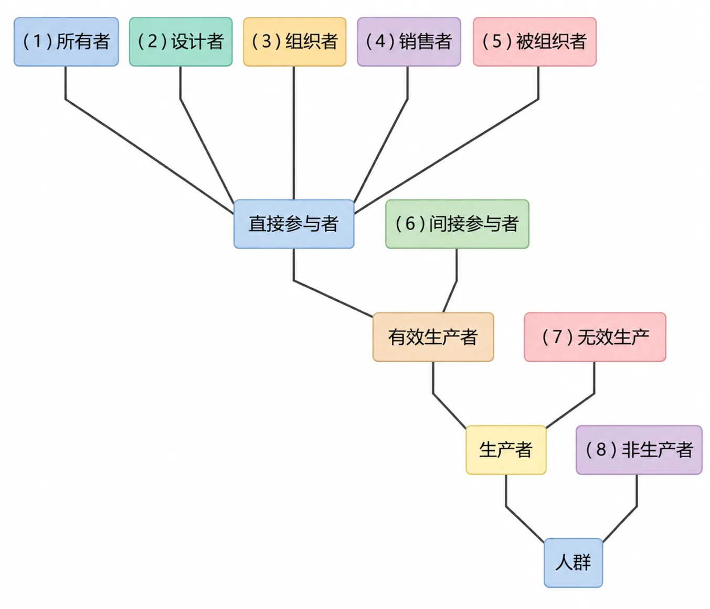
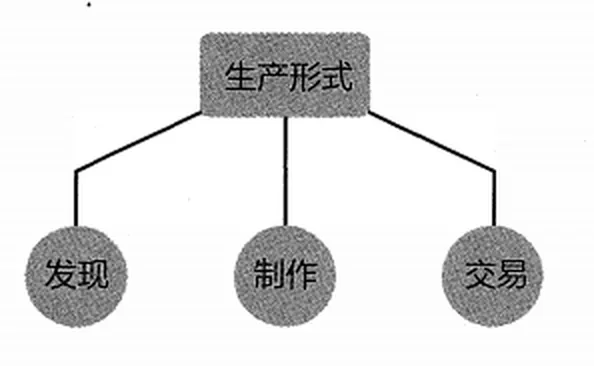

# 生活艰辛的根本原因

生活艰辛的本质，无非是花得多赚得少，即收入无法满足生活必需消费。事实上，正常的普通人并不贪心，要求并不高。可惜的是，到最后发现，即便要求那么低，自己竟然还是无法被满足，只能称其为“艰辛”。

想赚钱就得生产，因为财富的唯一正当来源就是生产；反过来，不生产就没钱赚。从本质上来看，人们收入的差异，主要源自与有效生产之间的距离。换言之，离生产越近的人赚钱越多，或者反过来，离生产越远的人赚钱越少。

生产，不见得一定能赚到钱。因为生产出来的商品或者服务，必须是能卖出去的，即能够满足社会需求的，才能赚到钱。否则，耗费多少时间、精力都白费。

所以，生产必须得是有效生产。

即便是有效生产，参与者还分为两部分：直接与间接。直接参与者还分为两部分：主要和次要。从主到次来看，分别是所有者、设计者、组织者、销售者，相对来看，被组织者是最次要的。

谁是有效生产的间接参与者呢？最明显的例子就是公务员——他们不直接参与生产，因为政府这个组织本身就是间接生产者。政府并不是非生产者，它本身也有协调社会生产的义务，同时，因为它承担了责任履行的义务，所以才可以名正言顺地收税。公务员虽然不一定是有效生产的直接参与者，但他们也不是非生产者，而是生产的间接参与者。

*有效生产的参与者层级：从所有者、设计者、组织者、销售者、被组织者、间接参与者到非生产者、无效生产者的赚钱排序*

如上图所示，人群之中赚钱多少，虽然不尽然绝对，但基本上的确按照（1）（2）（3）（4）（5）（6）（7）（8）排列。

千万不要以为非生产者虽然不赚钱，却更有可能比亏钱的无效生产者强。因为无效生产者毕竟去生产了，所以，即便是在失败的过程中，也会学习、总结经验教训，只要不放弃，就有改进或者翻盘，甚至成功的机会。而非生产者则完全没机会。当然，无效生产的设计者或组织者，相对于无效生产的被组织者更亏。

*各项因素占比示意（学校排名、地理位置、专业设置、学费）*

思考决定选择，选择决定命运。很多人的问题在于，从一开始可能就没想对，所以也没选对，于是，到最后怎么吃亏的都想不明白。当然，更可怕的是，很多人压根就不用自己的脑子认真思考。
