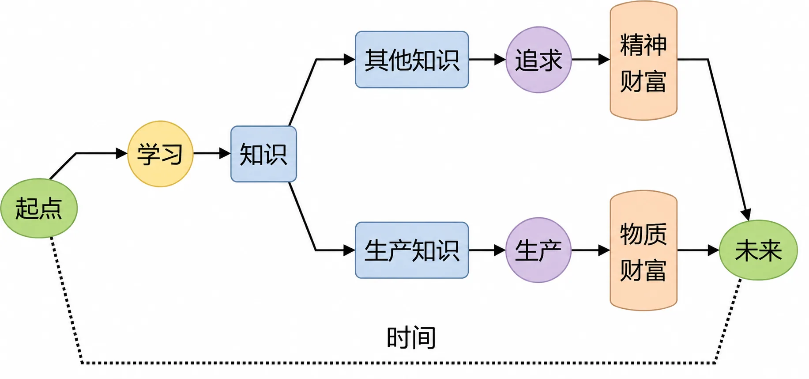
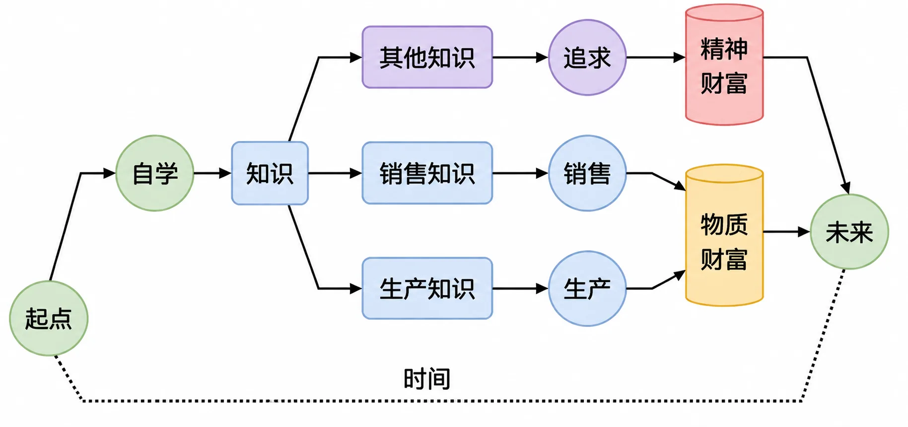

# 无能为力的教育体系

很少会有人否认教育的重要性。全球都一样，目前绝大多数家庭的生活支出中最大的组成部分就是子女的教育投入。从比例上来看，普遍超过三分之一。

这只是钱的投入，时间的投入更为惊人。

18世纪初，普鲁士王国开启了人类史上第一个义务教育制度。19世纪中期，日本受到西方工业文明的巨大冲击，为了奋起直追，明治政府将普鲁士教育体系几乎原样照搬回日本。19世纪末，大量中国留学生在中央政府和地方督抚的资助下涌入日本求学，其中包括章太炎、陈天华、黄兴、蔡锷、鲁迅、李大钊、陈独秀、周恩来、周作人、李叔同、郁达夫、田汉、夏衍等。

到了20世纪初，中国近代第一次由政府颁布施行的全国性法定系统学制“癸卯学制”[^1]，就完全参照了当时日本的学校制度模式。接着大约20年后制定的“壬戌学制”，就是现在我们常见的“六三三制”来源，即小学六年、初中三年、高中三年。1986年，《中华人民共和国义务教育法》颁布，中国大陆开始正式实行九年义务教育。

最初的时候，人们初中毕业就可以开始工作，后来得高中学历才行，又后来本科学历才够用，再后来研究生学历才算说得过去……给人的感觉是，必要的教育从9年变成12年，又变成16年，再变成19年。这还不算学龄前各种事实上昂贵的学前班和兴趣班。如果一个人8岁开始上学，说不准得到27岁才开始找工作。

但是，从发展到盛行已经差不多300年的现代教育体系，重点培养的并不是有效生产的所有者、设计者和组织者，也不是销售者。它所培养的，主要是生产的被组织者，或者生产的间接参与者。总而言之，它不是以生产为导向的，也不是以生产为中心的。

教育的金钱成本不断上涨，时间成本不断增加，再加上教育内容与有效生产脱节。一批又一批从学校里走出来的成年人，大部分都不懂生产、脱离生产，甚至主动远离生产或者厌恶生产。于是，绝大多数人在不知不觉间，花费了巨量的金钱和海量的时间，把自己变成了收入注定相对低的人群。

把之前的这张示意图重新画一下：

*时间作为终极生产资料的示意图（在教育体系语境下重画）*

人生可以有很多追求。钱也好，财富也罢，的确不是也最好不应该是人生的全部。可问题在于，凡事总有个先后，先学会必要的生产知识，才能通过生产过上好日子。否则，生活艰辛的情况下，所有的追求都会变得苍白。

*人生诸多追求有先后：先学会生产知识，才能过上好日子*

每个人的时间都有限，于是把时间花在哪里很重要。很多人的确花时间生产了，却不幸从事的是无效生产。同样的道理，很多人也的确花时间学习了，却不幸学的是无关生产的东西，所以才赚不到钱。

如果基于种种原因，生活必需不是问题，并且长期都不会成为问题，那么，不从事生产，甚至从事无效生产，或者学习无关生产的东西都无所谓。但只要尚未摆脱生活的束缚（人毕竟是消费动物），那么，就一定要先学习生产相关的东西，一定要想办法先从事有效生产。

就算不能设计、组织有效生产，也要尽量去做有效生产的销售。这没什么可争辩的。

绝大多数人一辈子从未直接从事过生产，所以他们就不可能教育自家孩子如何生产；绝大多数人一辈子从未从事过销售，所以他们也不可能教育自家孩子如何销售。最神奇的是，这两样东西恰好都不能，也不用指望教育体系，要么靠家长言传身教；要么自学，而后再作为家长言传身教。

另外一个重点值得反复提醒：无论是物质财富还是精神财富，到最后，全部都来自花自己的时间获得的知识，即一生中能拥有的一切其实全部都出自于自己的时间。

[^1]: 癸卯学制：1904年（清光绪三十年）由清政府颁布。因制定颁布于旧历癸卯年，故得此名。
