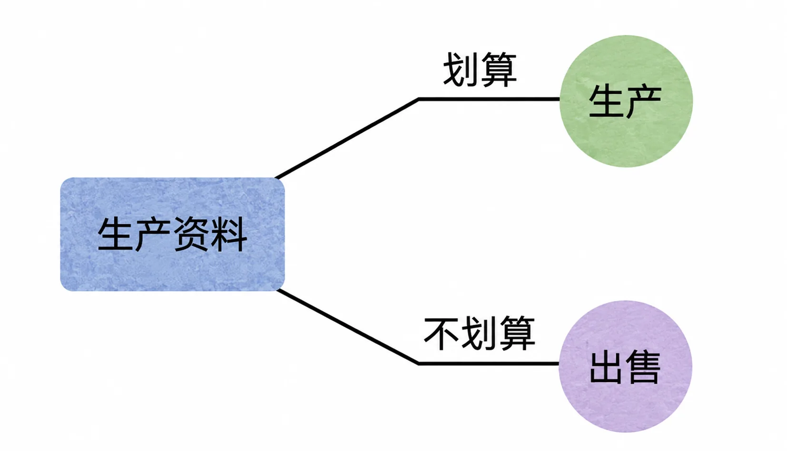
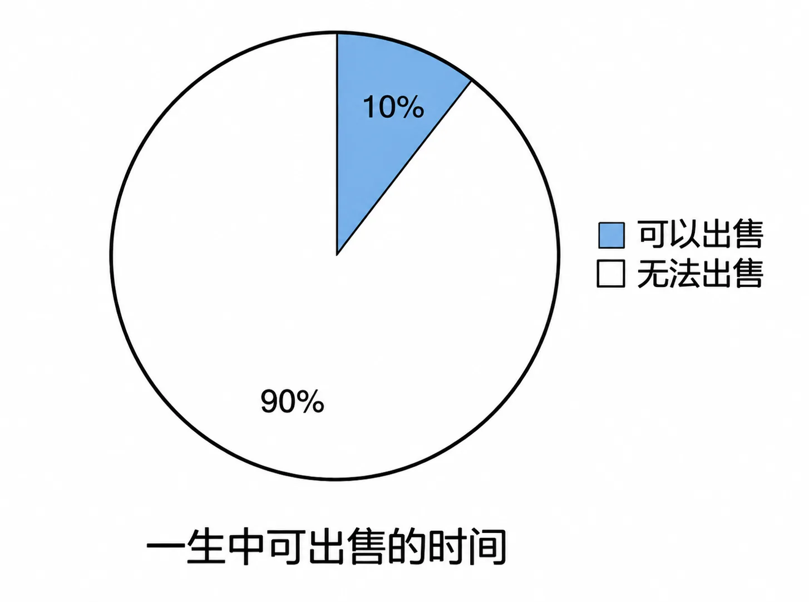

# 荒唐地出售生产资料

回到之前的一个重要结论：时间是我们的终极生产资料。要命的是，人群之中，99% 的人靠直接出售时间来获取收入。

可问题在于，时间是最重要的生产资料，甚至是我们的终极生产资料。之前我们也得到过这样的结论：我们一生中赚到的所有钱或财富，从本质上来看，全都是从自己的时间里挖出来的。

生产资料要被用来制作成商品或者服务之后再卖出去才更划算啊！泥巴可以做成砖头，请问：卖泥巴赚钱还是卖砖头赚钱？砖头可以用来盖房子，请问：卖砖头赚钱还是卖房子赚钱？哪有直接出售生产资料的啊？亏大了！也就是说，任何时候都一样，把生产资料直接卖出去肯定是最不划算的。换言之，把时间直接卖出去肯定是最不划算的！这很难理解吗？

可惜，绝大多数人终其一生的个人商业模式，就真的只是在把自己的时间不经任何加工直接卖出去。然后，只在这个层面拼命地卷，比谁的时间单价更高，仅此而已。

其实，我们能出售的时间真的很少。

一天 24 小时，睡觉得 8 小时，吃饭、如厕、洗漱、娱乐、休息、学习等都需要时间。而后，大多数人可用来上班或打工的时间也不过 8 小时，差不多一个白天而已。这已经筋疲力尽了，所以随着社会的发展，休息日会越来越多。一周 5 个工作日，去掉节假日，一年 365 天里大约只有 230 天可以工作。而其中实际可出售的时间也只不过相当于 76 天而已。另外，25 岁之前要上学受教育，60 岁退休了就不能再直接出售自己的时间。所以，如果活到 70 岁的话，就相当于要再次砍掉一半的可出售时间，现在只有 38 天了，这还没算上中途失业的情况。

整体算下来，在 70 年的生命过程中，可以直接出售的时间差不多也就 10% 而已！在能直接出售的时间那么少的同时，还要把它以那么低的价格出售，实在是不划算。

*一生中可直接出售的时间占比：扣除睡眠、生活、学习、退休后仅剩约 10%*

当然，每个人的情况不一样，刚开始的时候都可能要有一段时间迫不得已地直接出售自己的时间。但无论如何，都要想尽一切办法摆脱这种最差的个人商业模式。

*直接出售时间是最差的个人商业模式，应尽早摆脱*
