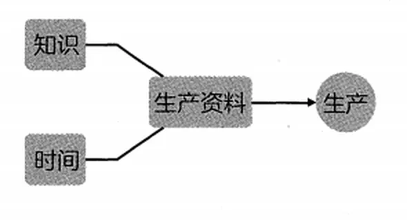
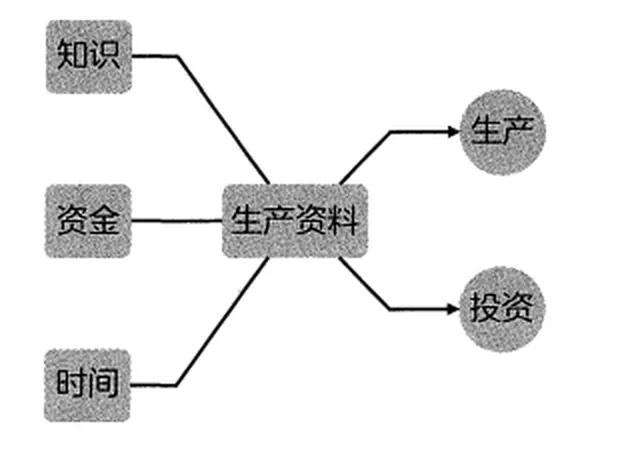
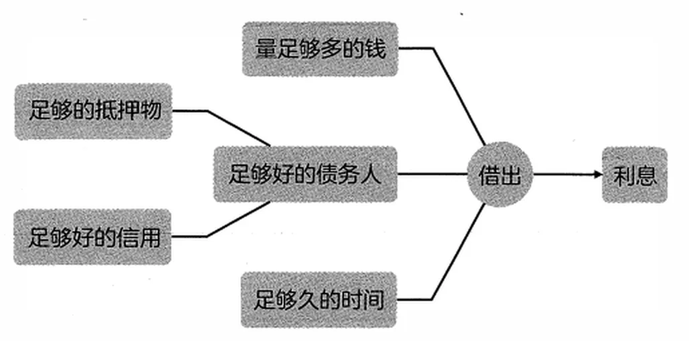

# 用钱生产的根本原理

投资的本质其实就是放贷收息。甚至，金融的核心不过就是利息；而整个金融市场事实上就是由且只由利率驱动的。

投资算是个相对时髦的词汇，可放贷收息就不一样了，它是个极为古老的行当。利率和利息的出现，实际上比我们今天习以为常的钱更早。苏美尔人泥板上的楔形文字记载了5000多年前人们借贷谷物的年利率33%。

也就是说，今年借3斤种子，明年得还4斤。

等到人们手里有钱的时候，只有少数人有机会用钱赚钱，因为用钱赚钱的一个重要前提是钱的量要足够多，否则借不出去。换言之，得把零钱通过时间积累成资金才可以。

这显然是一个漫长而艰难的过程，事实上绝大多数人做不到。只有少数人发现了这个事实，并且只有极少数的人最后手中真的有了足够的资金，才有机会去观察、去感受：钱竟然也是一种生产资料。

对绝大多数人来说，生产大抵上是这样的。

*绝大多数人的生产流程*

但对少数手中积累到了资金的人来说，生产还有另外一种：投资。

*少数有资金者的另一种生产：投资（放贷收息）*

关于利息产生的原因和机制，经济学家各有各的说法，且经常闪烁其词。不管他们怎么说，我们作为普通人，只需要“朴素地思考”（或称“笨寻思”）。

资金和时间一样，是排他性资源。也就是说，它们的使用都有机会成本。你可以用你的资金去购买任何必要的生产材料，再用你的知识和时间去生产，而后，你把你生产出来的商品或者服务卖出去，你就可以赚到钱。

可是，你把资金借给我了，你就失去了自己生产的机会，所以，为了公平起见，我应该在归还本金的时候，还要加上适当的利息，作为你的机会成本补偿。

利息是资金的机会成本补偿。

非常遗憾的是，这么简单的思考就可以得出的结论，历史上人们从来都没有达成共识。对利息以及利率的各种负面情绪直到现在依然普遍存在。

资金是排他性资源，它天然具备机会成本。可资金这个东西，若是仅仅攒在自己手中的话，那么它的机会成本等于0；一旦把它借出去，那么，它的机会成本就大于0。而利息这个东西，从本质上来看，就是借出去的资金的机会成本补偿。

也就是说，资金本身无法直接产生利息，它一定要借出之后才可能有利息。

钱得足量才能被称为资金，但这还不够，还得有足够久的时间加持。

无论利率多高，一分钟前借，一分钟后还，时间太短了，生成的利息实在太微薄，以至于可以忽略不计。因为利息的计算公式是：利息=利率×时间。

那么问题来了，风险藏在时间里，或者反过来说，未来充满了风险。随着时间的推移和展开，风险总会出现，或大或小，别说利息了，万一连本金都收不回来就麻烦了。

所以，在任何时候、任何地方都一样，债权人或者放贷者花最多时间研究的，都是如何尽量规避风险。其中最重要的就是债务人是否合格。

债务人要么必须有足够的抵押物，要么必须有足够好的信用。于是，若是总结一下的话，利息生成的前提大抵如上所述。在这些前提条件满足的情况下，借出的钱在收回的时候，是连本带利回来的。这就是用钱作为生产资料进行生产成功之后的生产结果。

如果，对生产资料的分类是土地、劳力、企业家才能、资本的话，那放贷收息的行为压根就不可能属于生产。并且，由于放贷收息的过程中放贷者本质上没有付出劳力，这种“不劳而获”看起来是显而易见的“邪恶”。

但如果将生产资料分为知识与时间，那么，钱是可以通过习得知识，进而花时间进行生产，再通过交换获得的。而后，再把钱当作生产资料，与时间组合在一起，生产出了钱——这完全没差啊！再说，这只不过是认知差异而已。

事实上，绝大多数人并不知道，承担风险其实是更累的劳动。

*放贷收息也是生产：钱作为生产资料，与时间组合生产出了钱*
