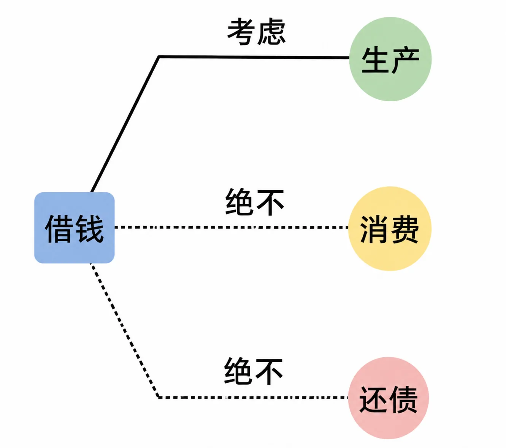
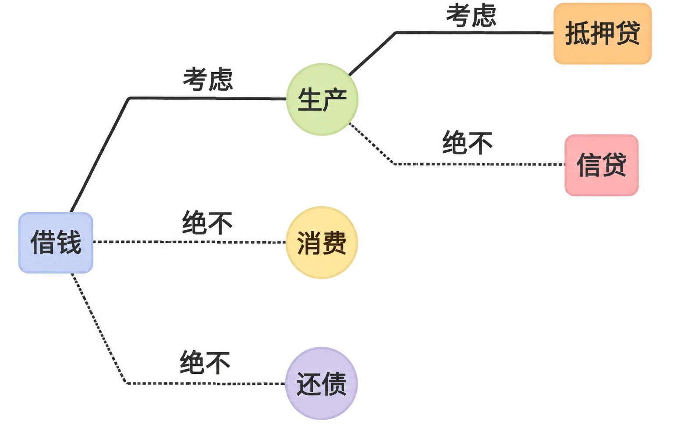
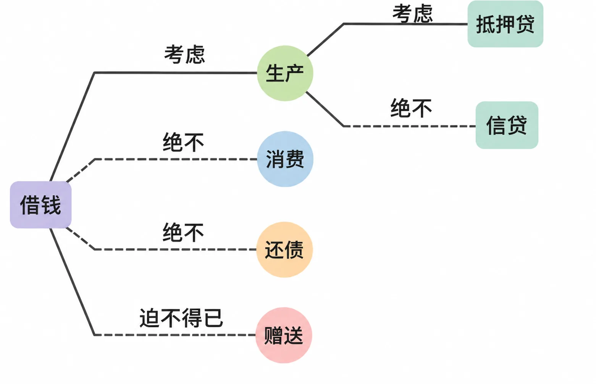

# 麻烦不断的民间借贷

虽然绝大多数人并没有机会从事严肃的放贷生产，但在日常生活中，普通人之间经常出现各种借贷需求。

又由于绝大多数人对金钱的本质和属性并没有深刻的认知，于是生活中绝大多数纠纷到最后都与钱有关。

如果有人向你借钱，你应该如何应对呢？假设现在有两个版本的你，一个是之前并不知道“钱是最灵活的生产资料”的你，另一个是已经洞悉这一切的你。那么，这两个版本的你做出的决策有何不同呢？

民间智慧有很多，比如“借三不借二”或者“救急不救穷”。不管这些建议有没有道理，现在的你和之前的你不一样。所以，你只要用一个简单的原则就可以避开绝大多数的陷阱：借钱生产，可以考虑；除此之外，都不行。借钱消费？想都别想。理由既简单又无可辩驳：钱，更恰当的用处只能是生产。借钱还债？更不可能。已经有过一次“还不上”的记录了，还有什么信誉可言呢？

*民间借贷第一原则：借钱生产可以考虑，借钱消费、借钱还债都不行*

其实，这个原则反过来也适用，从自身角度出发，为了生产去借钱，可以考虑；为了消费去借钱，想都别想。进而，为了生产借钱之后，无论发生怎样的意外，都要想尽一切办法到期足额还上。

有时候，不借钱很难，亲情、友情都会成为理由和负担。但这时应该坚守第二个简单的原则：抵押贷，可以考虑；信用贷，想都别想。必须有足够的（即超额的）抵押物作为还款保障，利息可有可无；否则，绝对不行。信用这个东西，在隐藏于时间里的那么多巨大的风险面前，总是不堪一击。

*民间借贷第二原则：抵押贷可以考虑，信用贷想都别想*

万一，出于种种原因，你实在拒绝不了，前两条原则都被打破了。那么就要狠下心来，绝对不能借，干脆直接送一部分。这钱送出去了，就意味着，你从一开始就决定不可能再往回要。现在，唯一要考虑的是，你有能力送出去的量到底是多少？

仅仅20年前，生活中的借贷依然是个很大的问题。现在不一样了，银行业已经进入发展快车道，连过去极为血腥的消费信贷都变得极其文明，且相关法律完善。所以，现在的普通人，在正常情况下，真没必要向身边的人借钱，将来更是如此。只要是合理的情况，银行都能解决。如果某人竟然真的想向身边的人借钱，一个较为遗憾的判断是，此人的金钱观应该有较大的问题，或者他受到的金钱教育有极大的缺陷……另外，还有个现象值得一提：有办法用钱生产的人是没办法随便借钱出去的，因为他们的机会成本相对更高。深入思考的话，很多人随便借钱给别人并不是因为他们自以为的大方或者慷慨，而是因为无知或者无能。他们手中的钱的机会成本其实是零，所以才那么无所谓。当然，这种说法的确很难听，但话再糙理都不糙。

*实在拒绝不了时的处置：与其借出后纠结，不如从一开始就决定送出、不再讨要*
