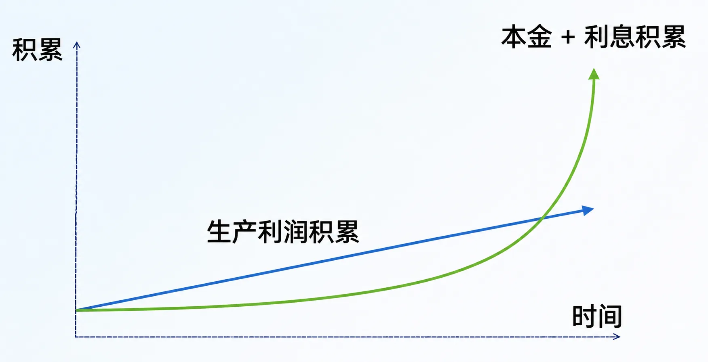

# 复利才是合理的现象

如果说利息是合理的，因为排他性资源的天然属性之一就是“借出之后要承担机会成本”。那么，复利也是合理的。

我从你那里借了一笔钱，谈好了年利率是 10%，那么，一年到期之后，我理应还给你 1.1x（x 是我从你那里借来的本金），到期我就还给你了。这时，可以认为这笔借贷的利息计算方式是单利。

可如果到期之后，我并没有连本带利全部偿还给你，而是决定延期。

那么第二年到期的时候，我理应还给你的是 1.1 × 1.1x = 1.21x，因为我相当于是在新的一年初始，向你借的本金是 1.1x，与此同时，从第二年初始开始，你承担的机会成本也的确是 1.1x，而非 x。而第二年的利息计算方式其实还是单利。

如果我坚持认为，不管我借多少年，都只能按照本金为 x 来计算利息。那么，事实很清楚：若不是你傻，那只会是我坏。所以，利息是合理的，复利也是合理的。其实，单利才不是唯一合理的，甚至有悖天理。

长期以来，人们不仅误解金钱，也误解利息。比如，亚里士多德始终坚称钱不是活物，所以天然不具备繁殖能力。所以，借钱收息，不管单利还是复利，只要收利息，就是有悖天理的。不管亚里士多德错得多离谱，他的观点到现在还在影响着许多人。

亚里士多德没想过钱是最灵活的生产资料，那么他也就没有想过，钱其实等同于任何可以用它从整个社会换来的活物。就这样，钱相当于间接拥有了繁殖能力。

当然，被误解最深、最广的，肯定是复利。“利滚利”和“高利贷”这两个完全不同的概念，在日常生活中经常被对等互换地使用，古今中外皆如是。而公开谴责复利的名人也多到数都数不过来的地步，随便罗列几个，比如莎士比亚、牛顿、凯恩斯等。

复利这个东西，从几千年前谷物借贷时就存在。

到今天，全世界所有允许信用卡发行的国家，银行计息用的也都是复利计算方式：按日收单利，按月收复利。

我们可以恨它，可以骂它，可以谴责它、诅咒它，可无论怎样，到最后还是得与它共存。这是所有真相的共性：真相不灭，也不为任何人的意志而转移。

再进一步，单利其实是线性增长的，复利是指数增长的。

指数增长令人迷惑的地方在于，它在相当长的一段时间里，低于线性增长。然而，它的增长速度就好像是有加速度一样，不仅涨得越来越多，还在涨得越来越多的同时涨得越来越快。

*单利是线性增长，复利是指数增长：指数增长长期低于线性，而后急速超越*

在那个数学名词尚未创造的年代，甚至连文字都很原始的年代，放贷者和借贷者之间的知识差异就已经存在。人群中极少数的放贷者几乎很快就凭直觉掌握了这个秘密；而绝大多数的借贷者从未真正有机会去理解这个所谓的秘密，只是因为攒钱太困难了。在整个社会发展过程中，他们总是要等到落入利息差的“陷阱”之后才大惊失色。
