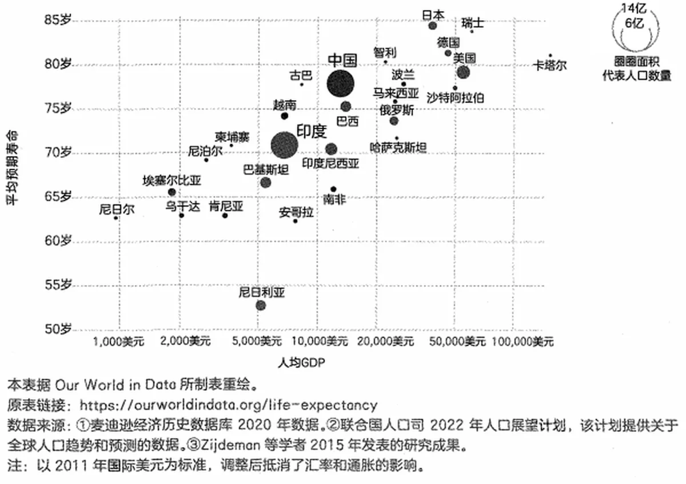

# 全球经济水平总体持续向好

为什么说“全球经济水平总体持续向好”呢？原因有两方面：一方面，是我们所拥有的时间实际上相当充裕；另外一方面，是我们的生活成本，尤其是生存必需的成本，事实上一直在持续降低。这主要源自生产效率的加速提高。

以“光明”的成本为例，4000年前，古巴比伦人用芝麻油点灯，那时候，一个人一天的工作只能换来10分钟的照明；18世纪，人们开始用煤油，于是，一个人一天的工作能换来5个小时的照明；20世纪初，电力才开始普及起来，之后一个人一天的工作能换来多少小时的照明呢？笔者没有查到具体数据，反正，除了照明之外，还可以购买很多别的东西。

*光明的成本随生产效率提升而持续下降：一天工作换来的照明时长变化*

到了今天，我们一天工作所能获得的收入，能买到的照明时间是200年前的20000倍以上！

不断降低的不仅是光明的成本。衣食住行，各方面的生活必需成本都在持续降低。最重要的是，安全的成本也随着社会技术的进步而不断下降。除了法治的发展在起作用之外，科学技术也在悄悄极速降低安全成本。

比如，今天人们出门几乎完全不再担心扒手了，因为人们已经不用现金很久了。但真的很久吗？我写这些文字的时候是2023年；《天下无贼》是2004年的贺岁片；而另外一部根据真人真事改编的电影《神探亨特张》于2012年上映，讲述的是北京市海淀区双榆树派出所的一名便衣民警每天抓小偷的故事。

在距今仅仅10年的时间里，突然之间，大街上的摄像头多了起来，直到无所不在。它们无疑对犯罪率的降低起了最大、最广、最重要的作用。再比如，无所不在的导航系统和定位装置，消灭了几乎所有的偷车贼。

不仅是生活安全，连金融安全都在不断改善中。

2018年开始的经济衰退、2020年突然出现的新冠疫情、2022年全球范围内出现的青年失业率提高等现象，让悲观情绪四处蔓延。事实上，他们只是没有把“思考时间跨度”拉得足够长而已。一旦把它拉长到一定程度，能看到的就是截然相反的景象：无论如何，我们都生活在最好的时代，并且发展一如既往地势不可当。

经济危机是发展过程中必然经历的阶段。令人高兴的是，从历史趋势来看，经济危机的持续时长正在不断缩短，因为越来越高的生产效率正在发挥越来越强的经济调节作用。受1929年开始的“大萧条”影响，金融市场从断崖下降到最低点开始重铸，消耗了整整4年，总计48个月；受2007年年底开始的“金融海啸”影响，股票从2007年10月跌到2009年3月，而后开始从最低点重铸，只经历了1年5个月，总计17个月。

无论如何，明天会更好。就算偶然不好，恢复得也越来越快。
