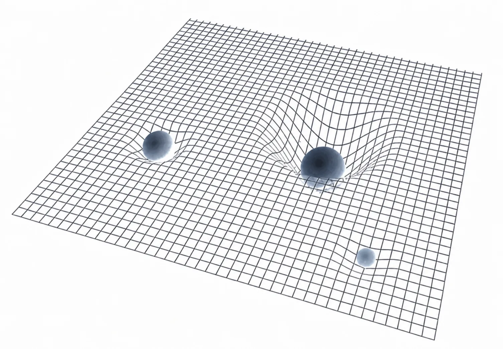
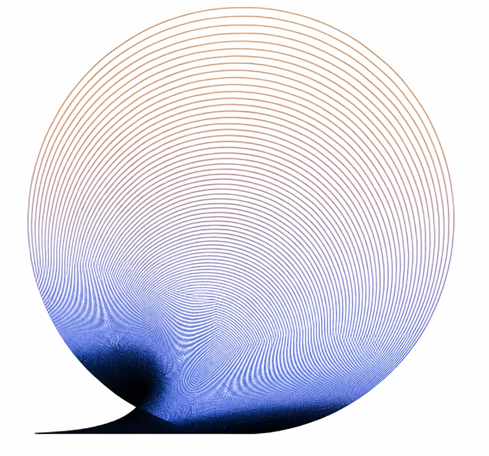

# 个体时间的实际形状

在物理学中，“时间”被认为是一个矢量。而“时间”和“空间”构成的“时空”是一个曲面，受重力的影响，重力和质量相关。

这个知识影响了绝大多数人的感知，人们在不知不觉间把“时间”理解为一条射线，从自己的出生指向未来。

然而，我们也许应该修正一下对“自己的时间”的认识和感知。在我看来，它可能不止一条射线，它更像是一根直径不断扩大的管道，通往未来。

*时间不止是一条射线，更像一根直径不断扩大的管道*

时间就好像是个容器，里面装着的是过往到现在经历过的所有人、做过的所有事。显然，每个人的时间容器大小不一。

时间这个容器有起点和终点，但在起点和终点之间，时间更像是一根管道，而不仅是一条直线。有的人单位时间里做的事情比别人更多，效率更高，那么，此人的时间和别人的时间不一样，直径更大，管道更粗；有的人在很长时间里什么有意义的事都没做，那么，此人的时间在那段时间里，只不过是一根直线而已。

2020年的时候，我做过一场回顾讲座，主题是“十年五本书”。

我从2003年开始写书，6年写了2本：《TOEFL核心词汇21天突破》和《TOEFL iBT高分作文》。从2009年出版《把时间当作朋友》算起，随后的10年里总共写了5本书，另外4本分别是《财富自由之路》（2016）、《韭菜的自我修养》（2018）、《自学是门手艺》（2019）和《让时间陪你慢慢变富》（2019）。

> 我的时间直径越来越大，我的时间管道越来越粗。

*作者自述：时间直径越来越大，时间管道越来越粗*

2022年4月，我遇到一个令我特别恶心的坏人，对我做了很多坏事，搞得我心情极其糟糕。到了5月份，我开始想办法转移注意力。当然，这种做法对我来说已经习以为常：遇到问题解决问题，能解决多少就解决多少，无论解决得怎样，下一步都应该是干活儿去，并且，最好干赚钱的活儿去。

干什么活儿赚钱呢？生产、销售、投资。反正，绝对不能把时间这个终极生产资料浪费到没有产出的地方去。

我开始写课。2019年之后，我更多讲课而不是写书，准备课程的工作量只比写书略微大一点，然后再通过社群将课程销售出去。从2022年5月12日开始，先是“好的家庭教育”，后来更名为“家庭教育的真相”，而后是“学习的真相”，再然后是“教练的真相”“人工智能时代的家庭教育变革”（已由“得到”平台发布），以及现在的“财富的真相”。

从刚开始的6年2本书，到后来的10年5本书，再到现在的1年5本书。

我的时间直径越来越大，时间管道越来越粗。到最后，连我自己都有点震惊。从2003年到2023年，整整20年过去了，站在起点上的我全然无法想象现在的情况。

之前，当我们说起“我们的时间相当充裕”的时候，我们只是把时间当作一个矢量，描述的是它的长度正在以越来越快的速度变长。现在我可能多少讲得更清楚、更明白了，关于“人人都能白手起家”的自信来自何处。

我们的时间不仅是一条射线，它其实是个可以越来越粗的管道。

到最后，大家相互之间可以比较的，不是长度，也不是面积，而是体积。仅比较一维的长度，能有多大差异呢？如果比较每时每刻的面积呢？那差异就大了，人和人的生产效率大不相同，十倍甚至数十倍的差异也并不令人惊讶。

然而，实际比较的甚至不是面积，而是体积，那差异可就太大了，难以想象。生产效率的提高，事实上是有复利效应的，只是很多人不相信而已，也有很多人费尽口舌向别人证明相信复利效应太天真甚至太愚蠢。

又，做到的人是如此之少，以至于我只能拿我的个人经历作为例子去说明。

幸亏，我这20多年里在这方面的经历，的确罕见的公开透明。

你还觉得时间不够用吗？
