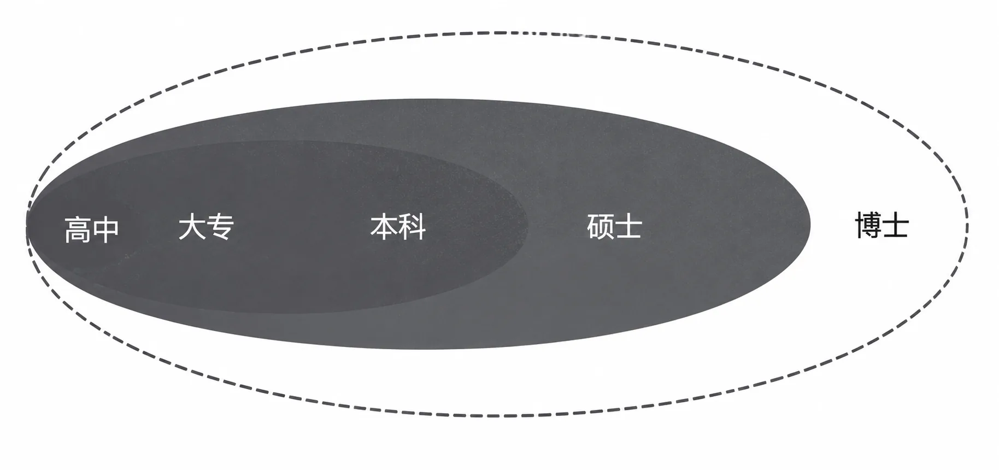

# 如何做到做更多的事

花掉时间赚到钱之后，我们要做更多的事。

可是，关于“做更多的事”，实在是很难有统一的标准或者大一统的价值观。“还有诗和远方”，倒是一种说法，不过，我更喜欢一种朴素的说法“做个更有用的人”，仅此而已。

首先当然是对自己有用，懂得如何从自己的时间里挖掘一切，无论是物质财富还是精神财富；而后，要对家人有用，能养家糊口，能让家人安心快乐，能教子女正常成长；再然后，还有余力的话，要对朋友有用；还有余力的话，要对社群乃至社会有用。到最后，这个世界总有很多伟大的人物，他们对整个世界都有用。

*做个更有用的人：依次对自己、家人、朋友、社群乃至整个世界有用*

我只是个普通人，所以，不敢想对整个世界有用，能做到对社群有用就已经非常知足了。当然，在此之前，必须经过检验，证明自己的确对自己有用、对家人也有用、对朋友还有用。

从2019年开始，我在自己的社群里不断讲课。基于“一切都是心理建设”，以及“心理建设只能靠像唐僧一样反复做”的原理，我不吝于重复。每次讲课前都会翻阅之前内容下面的留言，看到有人对内容的评价是“真的有用”，我就会由衷地感受到浓浓的幸福。当然，在很久之前我开始公开写文章、公开出版书籍的时候，这种反馈就陆续有了。只不过，正向反馈随着时间的推移越来越多。

总体上来说，我运气比较好。当然，我也有足够的理由去证明所谓的“好运”其实是选出来的。尽管是出于迫不得已，但我大学毕业之后从事的第一份工作是销售，于是，在赚钱这件事上，我从未觉得过分吃力。

后来我开始写书，也就是用最抽象的生产资料进行的生产，且再生产时间和销售时间都等于零的生产。

于是不知不觉之间有了积累，之后我进入了投资领域，又经过了十余年的时间，我彻底实现了“时间自由”，而不仅仅是“财富自由”。回头看，我并没有比别人更聪明，甚至不见得比别人更努力，但我通过正确路径的选择，的确享受到了“时代的恩惠”。

实际上，在这样的时代里，实现财富自由并非难事。虽然很多人感受不到，也不敢相信。可事实上，这都不过是基于当初的“路径选择错误”而已。比财富自由更为宝贵的，实际上是时间自由。

时间自由并不见得能够自然而然地让人做更多的事。

毕竟，这世界上有很多人，时间多到不仅可以浪费，甚至还要“杀掉”的地步。我个人的观察和总结是：只有通过提高生产效率获得的时间自由，才可能自动保证“做更多的事”。

因为对没有生产能力的人来说，时间只不过是一条射线，瞬间没有面积，长期没有体积，时间更不是什么生产资料。于是，时间只能“无聊”，无聊到“浪费”都不舒服，必须到“杀掉”的地步。

对有生产能力的人来说，时间这个东西实在是太美好了，它可以用来造任何东西，做无数的事情，甚至连亲情或者爱情都可以用时间“酿造”。并且，随着生产效率的提高，时间的可能性更多、更大。“无限的可能”不就是“罕见的自由”吗？

这就是我们痴迷于学习、不吝于学习任何技能的最激动人心的理由了吧！这本书里几乎所有的重要插图，都是我自己画的。我当然不是美工专业出身，然而，只要这个技能有必要，我就肯花点时间去学，以便提高自己的生产效率。比如，第22章的“时间管道示意图”，总计由292个直径越来越大的圆组成。如果不会写几行代码的话，我自己手工肯定画不出来。如果我不是一个什么都学的人，那么我就得去找插图师帮忙。这样一来，效率如何呢？原本对我来说，几分钟就可以做完的事情，现在可能需要若干天反反复复，还不一定满意。

到最后，做一个对整个世界都有用的人也不见得多么不可企及。我当然做不到像埃隆·马斯克那样“上天入地”，颠覆一个又一个行业，甚至干脆彻底改变世界。

可后来我也找到了一个自己能干的事：我种树总可以吧？从2016年开始，我出资在各地种树。最初是从敦煌那里开始，到现在已经快7年了，中间经历过旱灾和风暴，可已经有很多苗木变成了树林。说实话，种树并不贵，甚至感觉挺便宜，只不过，有心、有时间且不关心回报的人的确不多。

我相信，只要摆脱生活必需的支出负担之后，任何生产者都能找到各式各样对自己、对家人、对朋友、对社群，甚至对整个世界更有用的事去做，可能性无限。
