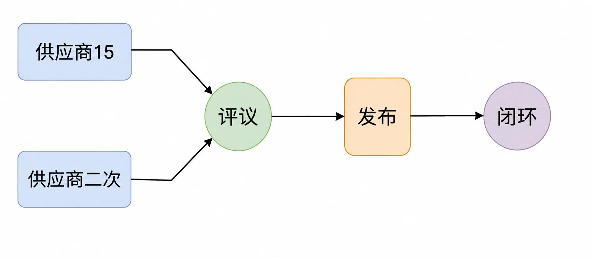

# 对现状不满的根源

进入21世纪后，全球范围内不约而同地出现了厌世情绪，以至于在事实上人类史上最好的时代里，竟然有很多人持有末日世界观。到底怎么回事？

一句话的解释：社交网络前所未有地展示并放大了真实的贫富差距。

在基于互联网的社交网络盛行之前，人们对自我的生活幸福感和满意度其实是相当高的，因为没有比较或者很少比较。人们线下的社交网络受“邓巴数字”的限制：英国牛津大学的人类学家罗宾·邓巴教授，根据猿猴的智力与社交网络推断，人类智力将允许人类拥有稳定社交网络的人数是148人，四舍五入大约是150人。这就是著名的“邓巴数字”，即，人类的社交人数上限为150人，精确交往和深入跟踪交往的人数为20人左右。

又因为人们普遍生活在属于自己的圈层之内，平日里对贫富差距感受并不强烈，就算偶尔感受到，也不会有什么过分的反应，很快就回到自己原本的生活中去了。毕竟，生活的幸福感和满意度的确并不完全取决于经济因素。

突然之间，全世界都被连接了起来，人们一下子看到了原本不可能看到的全貌。经济上，人们的差距还很大。中国14亿多人口，竟然有10多亿人没坐过飞机（2019年经济学家李迅雷撰文指出）；3亿～5亿人没用过抽水马桶；6亿多人月收入也就1000元左右；与此同时，在很多城市里，人均单次消费1000元以上的餐饮娱乐场所比比皆是。

不仅如此，社交网络还在有意无意地夸大这些差异。在朋友圈里发个“美颜”过的照片，还得拿“生图”作为基础修改呢，可对自己的收入进行“美颜”实在是太简单了——只要随便说、随便写就可以。在某个问答平台上，“年入百万”都是入门级，“谢邀”之后得先说“刚下飞机”，再说“今天头等舱的餐有点难吃”，而后再提到自己正在国外的一个国际机场喝着咖啡写回复……比较之后的失落，令人格外沮丧。原本幸福不过是“比自己的妹夫多赚20%”，现在对绝大多数人来说，连这样的“幸福”都被打破碾碎，顿觉“日子没法过了”。

*社交网络前所未有地展示并放大了真实的贫富差距，令人格外沮丧*

于是，他们压根想不起来自己其实活在人类史上最好的时代。

更大的关键在于下一步：体会到差异之后，却找不到解决方案。

在经历了3年疫情之后，经济环境暂时恶劣的情况下，至2023年5月，有报道称“网约车行业近年来涌入了大量司机，但乘客数量增长却已停滞，出现市场饱和、平台竞争加剧、司机收入下降等问题”。仅仅两个月前，另一篇报道是“外卖骑手饱和，部分骑手表示很早之前就已经人多单少了”。还有一个惊人的数据是“美团外卖员本科率达30%”。如此看来，现在大多数人做的事情从本质上来讲全都是在直接出售自己的生产资料而已。

之前就做了很差的选择——为了直接出售自己的生产资料而接受教育；失败显露之后，进一步做出了更差的选择——继续直接出售时间这个终极生产资料，并且选择的还是根本就无法持续学习的工作。

没有人教他们生产、销售、投资的必要性和重要性，到最后社会上极大比例的人心理上直接鄙视生产、鄙视销售、厌恶投资。然后在做出最差选择的同时，因为最差的选择所获得的最差结果而出离愤怒，抑或无可奈何。

而所谓的“戾气”，不就是无可奈何的出离愤怒吗？

然而，如果可以正确理解贫富差距的根源，就有可能找到解决方案，也就不会无可奈何，更谈不上什么出离愤怒。所谓的“平和”只不过是正常的普通或普通的正常而已。

贫富差距最初的确只是自然现象，但随着时间的推移、社会的进步、发展的持续，今天的贫富差距已经越来越出自生产效率的差异，至于最初的资源分布不均早已不再是关键因素，更不是决定因素。

“含着金钥匙出生”在过往的年代里的确是不可逾越的优势。那时人类的平均寿命太短，社会不公太深、太普遍，生产机会和销售机会都很少，投资机会压根就不存在。

可现在的确不一样了。一方面，我们有足够的时间，使我们有足够的机会，用足够低廉的成本获得足够有效的知识；另一方面，也是因为我们有足够的时间，让我们有机会重新来过。

反过来，在这样的时代里，“含着金钥匙出生”反倒可能遭遇所谓“资源的诅咒”——因为父母一辈的教育观念缺失，导致从小被娇生惯养，没有生产动力，没有销售欲望。他们倒是可以一上来就做普通人得积累很久才有机会做的投资，却常常因为钱很多而亏得惨，进而显得人更傻。此类例子比比皆是，无须在这里重复。

想办法提高自己的生产效率就完事了，就这么简单。
