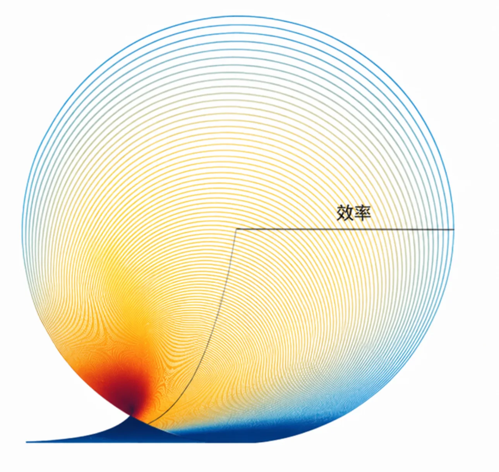
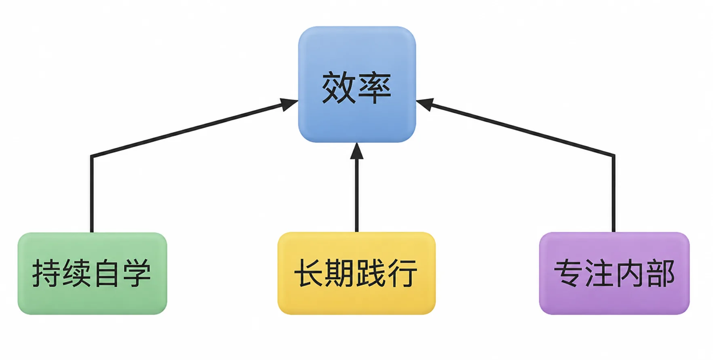

# 提高效率的基础原则

我们的时间，每时每刻都是一个圆，效率就是它的直径。到最后，一个人的时间体积取决于他的效率。也就是说，效率决定财富。

*时间每时每刻都是一个圆，效率是它的直径，决定时间体积与财富*

提高效率（尤其是生产效率）的方法论非常多，书籍、课程也不少。但最本质、最根本，当然也因此最有效的方法论却常常被忽略，它们分别是持续自学、长期践行和专注内部。

*提高效率的三大根本方法论：持续自学、长期践行、专注内部*

刚开始当然得被迫学习。如果没有强制，绝大多数人连写汉字都不会学习。然而，自学才是最重要的能力，没有人逼、没有人教、没有人陪，自己就能学，仅此一点就能超过极高比例的人群。

学习的动力原本应该超级大。一个人识字了，相当于是仅用了几年时间就走完了人类很多万年的进化。认识阿拉伯数字似乎很简单，但那可是直到12世纪左右才传到欧洲，到了13世纪才在斐波那契的倡导下被普及，到了15世纪才被数学家们全面采用的。

每当你学到一个新知识，对你来说“那只不过是你的一小步”，可与此同时，那可真的是“人类的一大步”！

又比如，你在读小学的时候，没花太多工夫就在学校和老师的帮助下理解了“负数”的概念。可你知道吗，人类发展了很久很久，直到公元1世纪的时候，中国汉代的《九章算术》里才有了“负数”的概念。等到你上了九年级，在物理课上学到了“能量守恒”，又没花太多工夫就在学校和老师的帮助下理解了。而对整个人类来说，那可是从《九章算术》的时代开始算起，再过1700多年，十几个来自欧洲不同国家、不同领域的科学家各自独立发现并证明的理论，其中的主要贡献者之一是焦耳。嗟乎！这世界真正的速成只不过是朴素的学习啊！

能把整个人类用那么长时间才搞定的东西，直接拿过来迅速建设我们自己的大脑皮层，多好玩、多开心啊！

一般来说，人们认为钱是可以攒出来的。但很可能从来都没人告诉过你，其实，时间也是可以攒出来的！

因为学习就是攒时间，学习就是攒命，学习就是延年益寿。

提高效率只能通过学习，要是能自学，那效率就更高。有些事情，必须优先学习，比如生产、销售、投资方面的知识。与此同时，优先学习并不意味着放弃剩下的一切。优先学习这些知识的原因在于攒时间、提高效率，然后可以做更多的事。自学这个动作，要尽早掌握，然后要做一辈子，因为那是开发时间这个终极生产资料的最佳方式。

学习这个动作，实际上至少包含学、练、用、造这四个层面。所以，只学不用是浪费时间，也是绝大多数人学习失败的根本原因。学到了就要用，学到了就要践行。践行的过程，实际上是提高效率的唯一途径。通过大量的迭代（不仅仅是重复），不断积累、不断改良。效率永远不可能一蹴而就，因为效率这个东西，只能是发展出来的。

从一开始就建立严格的筛选机制，尽量只挑值得做很久很久的事。仅此一条，就能引发天壤之别。因为一上来选的就是值得做很久很久的事，所以，自然而然地只能长期践行。又因为的确做了很久，自然有积累，自然有改良，效率自然有发展。什么事值得做很久很久啊？就是那些有积累效应的事情。真的很巧，生产、销售、投资以及自学，都有积累效应。

除了持续自学、长期践行之外，还有就是专注内部。值得关注的外部，事实上很少，因为外部的绝大多数事情与提高自身生产效率毫无关系。沃伦·巴菲特说自己不看新闻，我认同他这个决策，却有不太一样的理由：因为关注新闻需要时间，可与此同时，它消耗了我的时间却并不提升我的生产效率——这是100%亏本的买卖，不能搞。

生活中一定会发生这样那样的意外，会遇到坏人，会遇到坏事，但它们都是外部因素。它们存在或者出现本身已经破坏了我的发展，绝对不能让它们进一步吞噬我那终极的生产资料。毕竟我的所有财富，不管是物质财富还是精神财富，全来自我的时间，或者准确地讲，来自我的时间的体积。我哪有什么时间可以浪费呢？又有什么道理浪费在它们身上呢？时时刻刻，专注提高效率才是正事。
