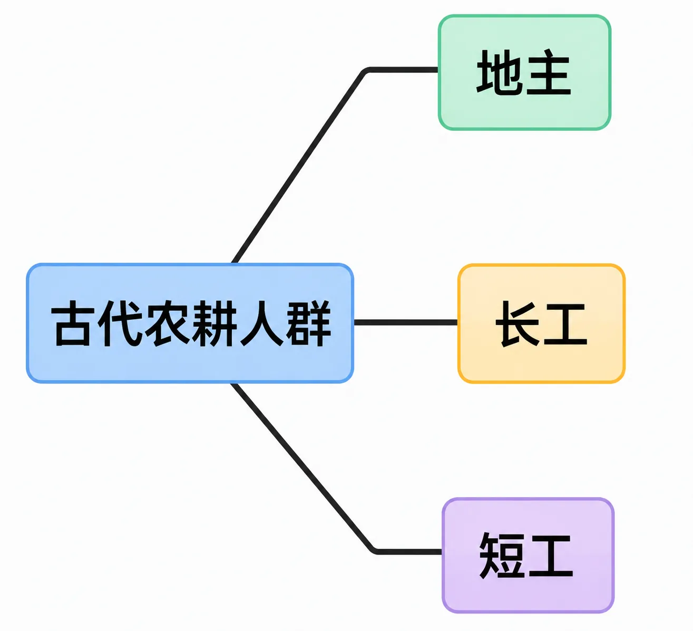
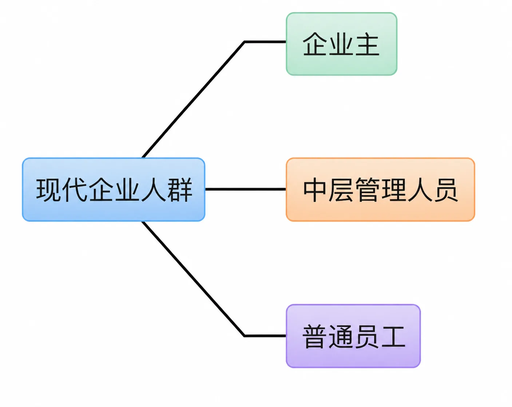

# 思考时间跨度的影响

之前提到过一次思考时间跨度：不仅是生活安全，连金融安全都在不断改善中。2008 年开始的经济衰退、2020 年突然出现的新冠疫情、2022 年全球范围内出现的青年失业率提高等现象，让悲观情绪四处蔓延。

事实上，他们只是没有把“思考时间跨度”拉得足够长而已。一旦把它拉长到一定程度，能看到的就是截然相反的景象：无论如何，我们都生活在最好的时代，并且发展一如既往地势不可当。

人与人之间最大的差异，其实来自人们的思考时间跨度各不相同，且差异巨大。

我们还是可以从贫富差距谈起。之前，我们讨论过，贫富差距的产生是无论如何都不可避免的，其中还有一个主观的原因，就是人们对时间的认识各不相同。

最能拉开人与人之间距离的，就是思考的时间跨度。只能思考当下的人，和思考未来一年的人，以及思考未来十年，甚至思考未来五百年的人，没办法相同，因为时间就是生产资料。与此同时，我们一生的所有收获，无论是精神上的还是物质上的，归根结底，都是从时间（无论是自己的还是别人的）里挖出来的。

想象一下，如果你出生在还没有人种庄稼的时代。白天，你要和别人一起出去弄吃的回来：采果子或打兔子。如果带回来的食物太多，以至于食物坏掉之前大伙都吃不完，你会挨骂的。为什么？因为那叫暴殄天物，原本大自然帮我们保存着完好的食物，结果被你浪费掉了！那时候，时间观念压根就不重要，谁也没办法想太多。

后来，人们开始种庄稼了。农业时代引发了少数人时间观念的变化，甚至，反过来说也行，是少数人的时间观念发生变化，才开启了农业时代。种庄稼，起码要想到半年后吧。春天开始下地种庄稼，要到秋天才有收成，这期间就得有粮食储备。半年其实是不够的，因为这个秋天收割之后，要到下一个秋天才会有新的储备。可是，哪怕有一年的储备和计划，好像也不够，因为后面可能还有天灾人祸。所以要想更久、更远才行。

从那个时候开始，人群分层的结构就出现了：最初的时候，人口较少，土地却很丰富，所以，找到土地并不难，劳作也是大家都能做的。看得长远、想得长远，也就是长期观念，才是真正的核心竞争力。虽然起初大家都可以是地主，但到最后，只有少数人保住了地主的地位。最重要的原因是，只有少数人真正拥有长期观念。

要有长期观念，首先思考时间跨度得足够长，不是一个月，不是一年，而是十年，甚至更久。在普遍寿命三五十岁，成年需要十五年，且最后十年左右已经体力不支的年代里，看十年、想十年（甚至更久）的难度可想而知。

*长期观念要求把思考时间跨度拉长到十年甚至更久，这跨越的是未来*

然而，这个时间跨度所跨越的，不是过去和现在，而是未来。时至今日的我们，生活在连天气都可以预报的时代里；可在遥远的过去，那可真是“两眼一抹黑”，更多时候靠的是“赌”。拥有长期观念，持有长期观念，还要从始至终，其中所需要的是心智上的勇气，比起与暴力相关的勇气，根本就不在一个量级，当然也不在一个层级。

宋代的苏轼写过一篇《留侯论》，说：“古之所谓豪杰之士者，必有过人之节、人情有所不能忍者。匹夫见辱，拔剑而起，挺身而斗，此不足为勇也。天下有大勇者，卒然临之而不惊，无故加之而不怒；此其所挟持者甚大，而其志甚远也。”人们常常提起的“志向远大”是很好的描述，但我更喜欢用“思考时间跨度”这个更朴素、更直击本质的描述，因为越是简单、朴素、直接的说法，越是能清晰地指导自己的思考和决策。

相对于长期观念来看，土地所有权对地主地位的保障作用事实上很小，甚至可以忽略不计。即便是在暴力横行的时代，连暴力都需要长期观念的保驾护航，否则能够换取的不过是一时风光而已。

人群开始按照“个、十、百”的大致比例分化，比如一个地主，十个长工，一百个短工。虽然这个比例相当粗略，但地主最少，长工多一点，短工最多，这个事实从未变过。长工的酬劳，按月结算甚至按年结算。短工呢？按日结算。地主呢？自己给自己结算，而且是最后结算。

在任何时代里，从远古到今天，都普遍存在白手起家的案例。只不过，穿过表象看透实质的话，致富的最重要因素从来都不是勤俭，而是持有长期观念。在物质贫乏的时代里，谁不勤劳呢？谁不节俭呢？不开源节流，就没办法长久，不长久的富裕和贫穷事实上并无太大差别。

时间观念对人群分层的影响如此深刻，以至于三层结构如此稳固。

不管社会学家们用什么样的称呼，“阶层”也好，“阶级”也罢，三层结构从未发生变化，永远自顾自地存在着。你再看看现在的公司结构就知道了：有区别吗？普通员工的工资结算时间跨度最短，拿月薪。管理人员呢？拿的是年薪。企业主呢？最后结算。没区别，还是老样子。这是有固定工作的，没有固定工作的呢？去“打零工”，拿日薪或时薪。

*人群的三层结构自古未变：从地主/长工/短工到企业主/管理人员/普通员工，结算时间跨度各不相同*

我有朋友为了讨生活去了非洲。多年后偶遇，坐下来闲聊，他就曾说：“非洲吧，其实真挺好，说苦也苦，说累也累，但只要是中国人去了，没有不当老板的。因为非洲人实在是太懒了！”我给他讲了讲我的看法：“那只不过是时间观念在最底层发挥着决定性的作用。”他跳了起来，说：“对对对！那帮人，干两个小时后就跑过来要工钱，然后就到超市门口买两瓶啤酒，听着音乐扭着屁股，可开心了！”然后他坐下来，叹了口气，说：“还真是，我在中国算是没啥文化的，可就算目光再短浅，也比他们长太多了……”

今天的我们完全可以主动培养自己的长期观念，主动延长自己的思考时间跨度。更为重要的是，我们可以主动思考远比自己的一生更远的未来。其实这不是直到今天人们才有机会去做的事情，想想那些存续千百年的大家族就知道了，它们都有家训，若是没有足够的思考时间跨度和长期观念的话，他们无论如何都想不出那些最终被证明极为有效的教条、原则。

想要过上好日子，就去想办法不断延长思考时间跨度，这就是真把时间当朋友的核心方法论，亘古不变，就这么简单。勤劳与节俭也许的确有必要，但它们都不够充分；而足够好、足够强的长期观念才是真真切切的充分必要条件。

培养长期观念到底有多重要，已经无须进一步论证或陈述，但做好这件事花钱吗？好像压根就用不到钱。

成本几近于零，却有无限收益。这么好又这么简单的事，没道理不认真做啊！
