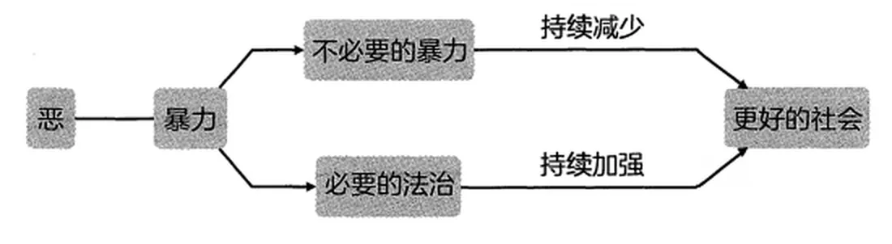

# 人间正道不一定沧桑

最初的时候，我们为了思考方便做了个假设：假设我们生活在一个完美的世界中。在这个完美社会里，坑、蒙、拐、骗、偷、抢，显然都是不可以的。

我们正生活其中的，当然不是一个完美世界；在真实的世界里，随处可见不公。

简单讲，一切的不公都是暴力造成的，无论是坑、蒙、拐、骗、偷，还是耍赖，甚至干脆明抢，都是不同程度的暴力。或者反过来讲，暴力几乎是公平的唯一敌人。

如果整个世界只有一个人、一个家庭、一个部落，暴力就算有价值也并不大。只有多方（很多人、很多家庭、很多部落）存在的时候，才会产生利益冲突。而最初的时候，暴力是解决冲突的最简单、直接、粗暴、有效的手段。

起初，暴力的价值是巨大的。用暴力傍身的人身强力壮，有更顽强的生命力。与他人一起的时候，就可以生抢硬夺。他们甚至可以躲避劳累，等人家费尽心机找到果子或者打到兔子之后，只需要花一点力气就可以抢过来。甚至，他们干脆通过奴役，逼别人干活儿，而后自己坐享其成。能抢必须抢，不抢不划算。

一切的冲突都事关利益。曾经，解决冲突最简单、直接、粗暴、有效的方式就是采用暴力。可问题在于，暴力的价值有天然的缺陷。首先，暴力的价值不持久，因为抢来之后只会消费，终究会坐吃山空，而后就只能再去抢；更大的缺陷在于暴力会吸引更强大的暴力，被抢的一方会想办法变得更强，一方面要避免继续被抢，另一方面可能还要抢回来，与此同时，总有更强大的另外一方在虎视眈眈。这是一个恶性循环。抢来的终将被抢走，这是暴力获益者难逃的宿命。

所谓的“冤冤相报何时了”，其实并不是一句无奈的慨叹，更像是客观的陈述。人类早就发现了和平的价值、妥协的必要，以及共赢的可能。而人类社会进步的过程，从某个角度望过去，本质上就是逐步消灭暴力的过程。在更好的社会里，和平更可取，妥协更必要，共赢更可能。

毫无疑问，暴力就是“恶”而非“善”。虽然人们到今天都在争论“人之初，性是否本善”，可有个事实是无法否认的：人类社会总体上是向善的，有史为证。可无论怎么发展，暴力始终无法根除，社会需要法治，而法治的本质还是暴力。只不过，这是社会讨论的结果，法治是“必要之恶”。

正如历史所展现的那样，发展限制暴力。也就是说，社会越发达，暴力对个体的价值就越低。事实上，从一开始，暴力的社会价值就是负数。如今，各种不公依然存在，但会越来越少，而且社会的确一直在向着更公平发展，趋势使然。暴力不断贬值的趋势，在全球都有明显的表现。

与此同时，不仅是社会中的暴力在不断贬值，个体所拥有的体力也在不断贬值。与之相对的，是智力的不断升值。无论是对社会总体来说，还是对单独的个体来说，都一样，智力的价值在不断攀升，并且攀升速度越来越快，攀升幅度也越来越大。

*暴力与体力不断贬值，智力不断升值——这是社会发展的趋势*

在平静对待“当下依然存在的不公”的同时，能看到不公正在减少的趋势，对任何普通人来说，都是极大的解脱与慰藉。与此同时，这也意味着希望。

我们不是盲目乐观。
