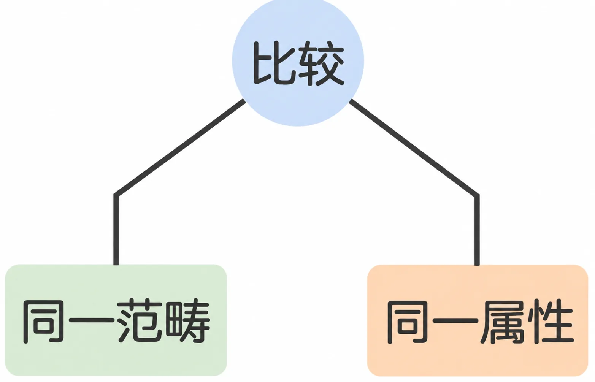
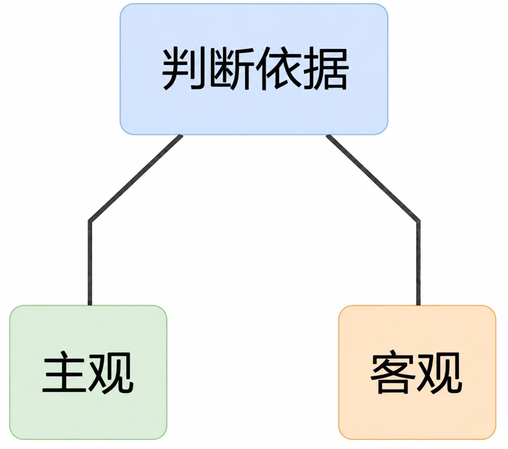
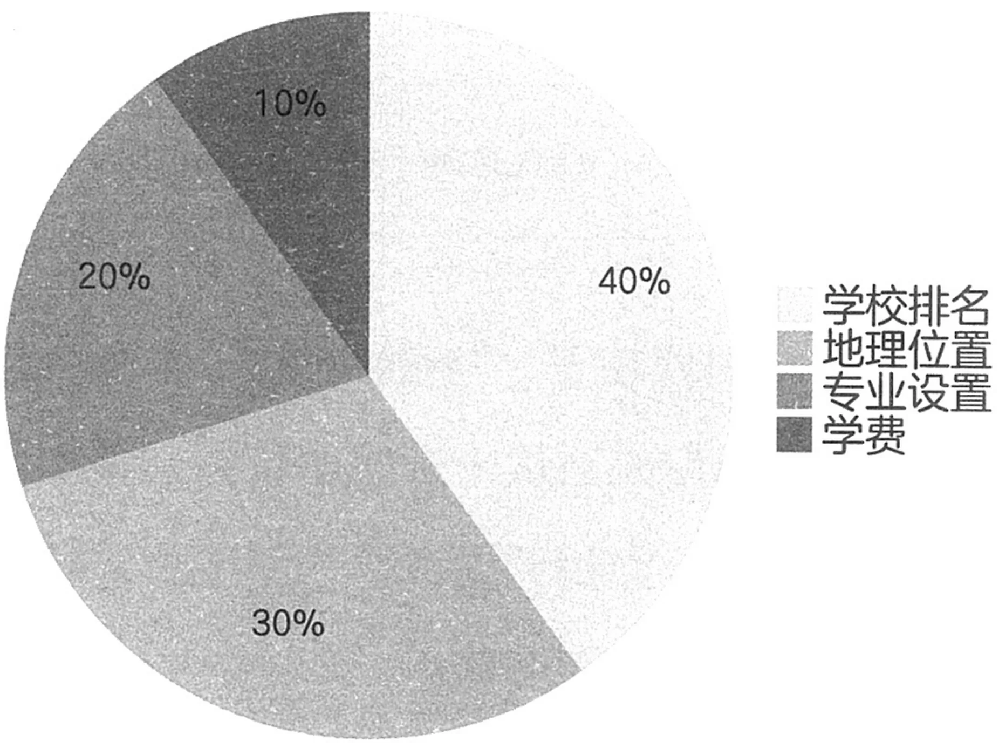

# 1.3 比较

两个事物之所以可以相互比较，原因有两点：一是它们属于同一范畴；二是它们拥有相同的属性。苹果和橘子都属于水果，我们会比较哪个更好吃，这是在比较同一范畴的两个不同事物之间的同一属性。

比较并不难，可人们在生活中经常不这么觉得。其主要原因之一是人们在生活中经常胡乱比较，不在意判断依据是主观的还是客观的。

主观的判断依据不是没用，只是它本身不可争辩，用它做出的判断也不可争辩。比如，“两件衣服穿在自己身上哪件更好看”这种比较，判断依据是主观的，无论是自己纠结还是与人争辩都无太多的意义。判断依据最好是客观的，这样它就可以被量化，可以被精确比较。比如，“两个人谁更高”这种比较，判断依据是客观的，身高可测量，相差的高度可计算。

当多个客观判断依据同时存在的时候，可以将判断依据按照重要性排列，分别给予不同的权重，给根据每个判断依据得出来的结论打分，逐一打分后，计算出总分，进而得出结论。

比如，孩子的高考成绩满足三所高校的录取条件，到底去哪一所？这个问题的核心就是比较，只要比较出结果，决策就呼之欲出。假设我们先确定了四个判断依据：学校排名、地理位置、专业设置、学费，然后按照重要性排列，分别给予不同的权重。

又假设我们认为学校排名最重要，权重为 40%；地理位置次之，权重为 30%；专业设置第三，权重为 20%；学费最不重要，权重为 10%。

*权重*

接下来，我们给根据每个判断依据得出来的结论打分。假设我们认为 A 学校排名最高，得 10 分；B 学校排名第二，得 8 分；C 学校排名最低，得 6 分。同理，我们给其他三个判断依据也打分，最后把所有的分数乘以相应的权重，加起来得到一个总分，如下表：

| 学校 | 学校排名 | 地理位置 | 专业设置 | 学费 | 总分 |
| --- | --- | --- | --- | --- | --- |
| A | 10×0.4=4 | 7×0.3=2.1 | 8×0.2=1.6 | 5×0.1=0.5 | 8.2 |
| B | 8×0.4=3.2 | 9×0.3=2.7 | 7×0.2=1.4 | 6×0.1=0.6 | 7.9 |
| C | 6×0.4=2.4 | 8×0.3=2.4 | 9×0.2=1.8 | 8×0.1=0.8 | 7.4 |

另一个困境在于，“判断依据”这个东西只能靠不断积累，谁都没办法从一开始就获得或掌握所有判断依据。举例来说，当我们要评价一部电影好坏时，可能会参考以下几个方面的信息：

- 电影的类型、题材、风格

- 导演、编剧、演员的基本信息和能力体现

- 电影的票房、评分、奖项等客观数据

- 电影的剧情、人物、主题、情感等主观感受

- 电影的社会影响、文化价值、创新意义等深层次的评价

日常生活中，人们给电影评分仅凭主观依据，打分体现的不过是他们看完之后“爽”的程度而已。一旦要求客观，我们就能体会到“比较”虽然看上去简单，工作量却非凡。这些信息都可以作为我们评价电影的判断依据。但是，我们不可能一下子就掌握所有的信息，也不可能对所有的信息都有同样的了解和认识。这种困境不仅存在于评价电影这样的日常场景中，也存在于更复杂、更重要的领域，比如科学研究、公共决策、商业竞争等。在这些领域中，判断依据的获取和使用更加困难，也更加关键，因为它们可能涉及人类的知识进步、社会的公平正义、企业的生存发展等重大问题。

这个困境没有一次性的解决方案，只能靠长期积累和持续更新。但反过来看，“没有一次性的解决方案”也能成为我们的动力，否则我们为什么要终身学习、终身成长呢？
