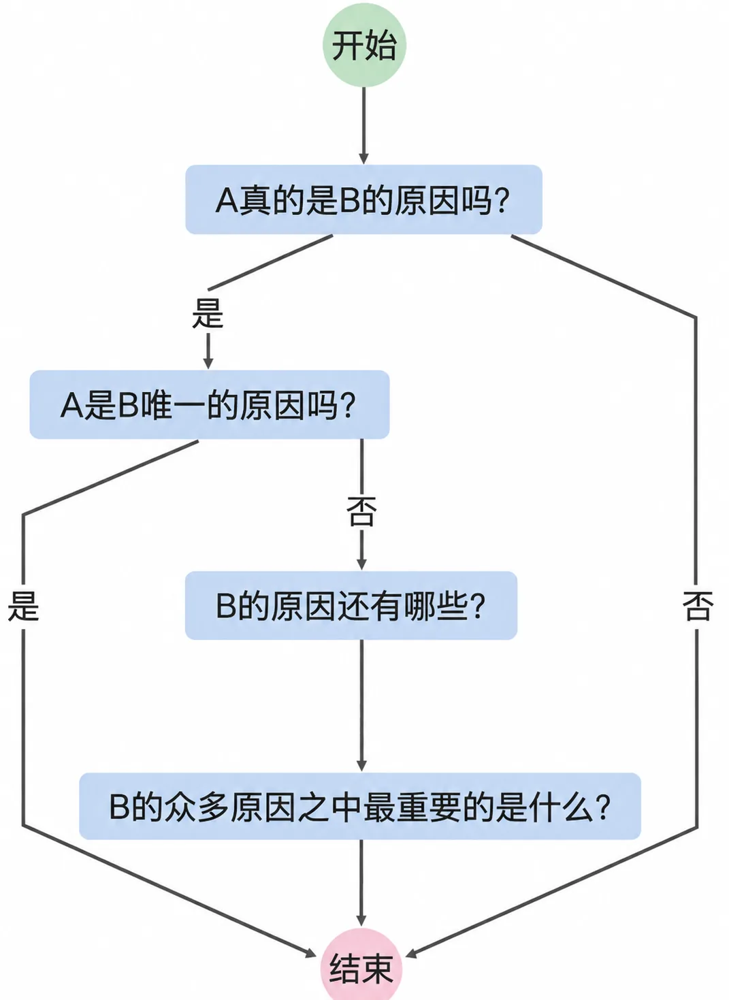

# 1.4 因果

当一个原因产生一个结果的时候，总是原因在前，结果在后。可我们从小就被教育过，时间上的先后顺序并不保证因果关系。学术上，因果关系的探究从来都不容易，甚至，因果分析几乎是科学的核心。所谓科学方法的实施过程，基本上都相当耗时费力且伤财。至于方法，理解起来都不太难，操作起来都相当吃力。

除了常见的观察法、实验法、统计分析之外，在不同的领域中，为了确定因果关系，科学家们各自努力发展出了许多方法。比如，在药学里普遍使用的双盲实验和回顾性研究，在法律领域里普遍认同的“谁主张，谁举证”原则，经济学的回归分析，社会科学领域的随机对照试验、差分法，计算机领域里的蒙特卡洛模拟等。

绝大多数普通人可能无法一一掌握。

在日常生活中，个体的研究能力和生产资料都有限，于是常常直接囫囵吞枣地采用专家得出的研究成果。不过，生活里问题太多，总是无法避免要自己动手研究。我们可以采取从以下四个方面入手的提问式模板，通过逐一自问自答来寻求答案：

> A 真的是 B 的原因吗？
>
> 如果 A 是 B 的原因，那么，A 是 B 的唯一原因吗？
>
> 如果 A 不是 B 的唯一原因，那么还有哪些原因？
>
> 如果 A 不是 B 的最重要原因，那么最重要的原因到底是什么？

这个提问流程虽然简单，却相当够用。日常生活里绝大多数因果分析，哪怕仅用这四个问题过一遍，就已经超越了绝大多数人的“思考”（或者绝大多数人的“不思考”）。

