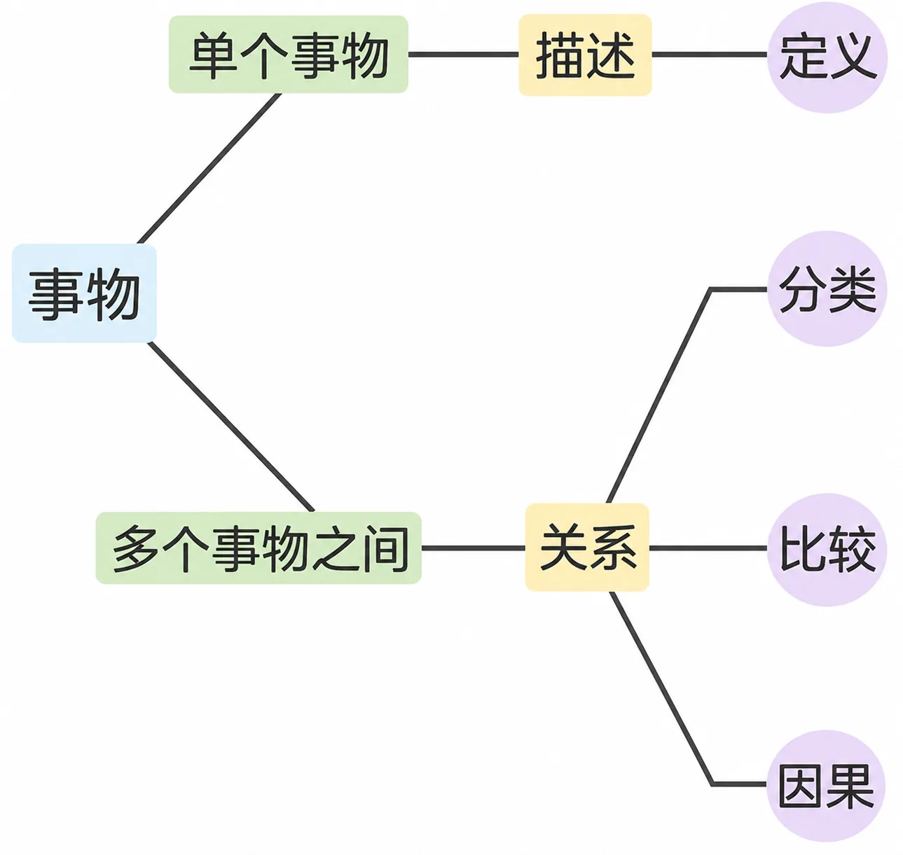
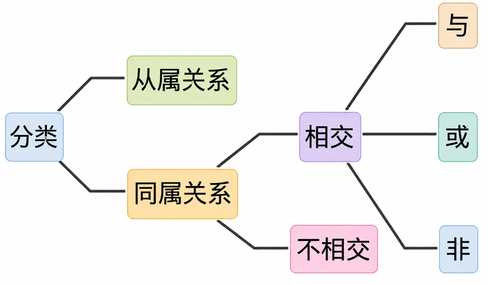
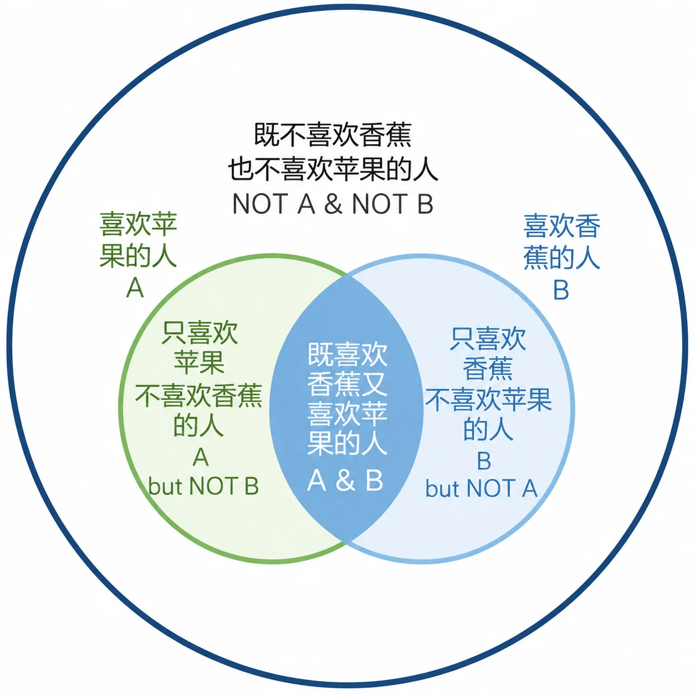
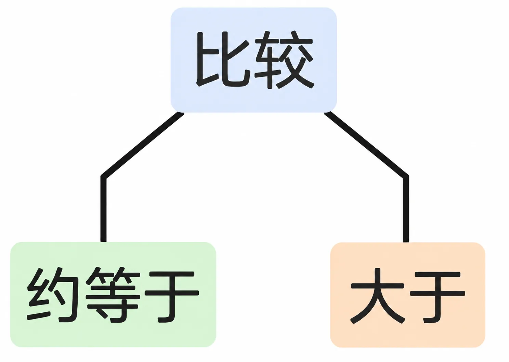
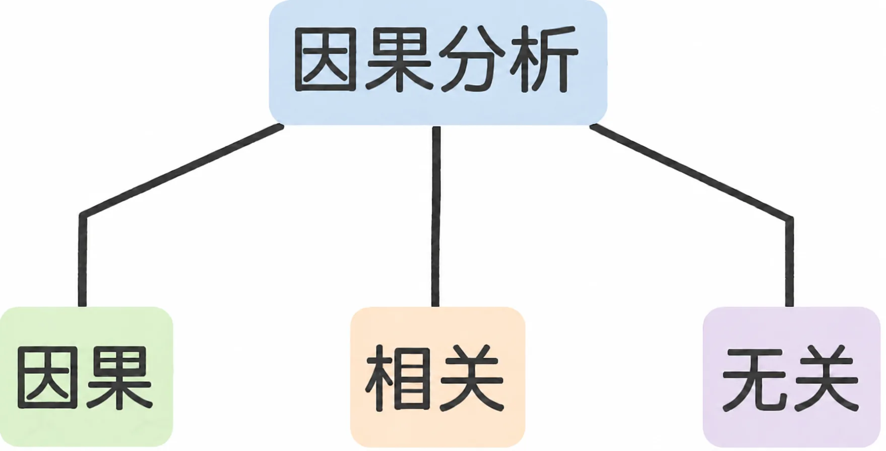
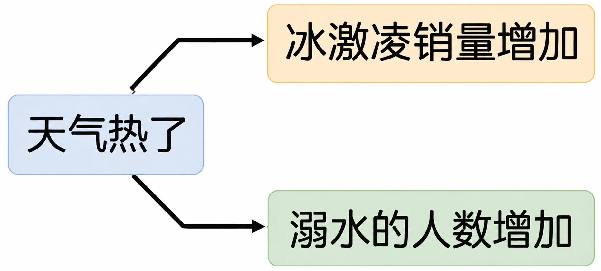

# 2.1 关系

进阶并不一定意味着高级。多个简单的东西叠加之后，可能就不那么简单了——原本简单的就不一定容易，现在可就更不容易了。

事物由定义描述清楚之后，分类、比较以及因果分析这三个动作，会确定事物之间的关系。

分类之后确定的关系有：

从属关系和同属关系很好理解。苹果属于水果，香蕉也属于水果，所以苹果和香蕉之间不是从属关系，而是同属关系，都属于水果。

若两个集合概念同属另一个集合概念，那么，这两个集合概念可能相交，也可能不相交。相交的两个集合概念，可进行“与或非”计算。与或非关系是指概念之间的逻辑关系，包括“与”（AND）、“或”（OR）、“非”（NOT），可以帮助我们更好地组织和理解概念。

> 与（AND）：要满足两个或多个条件的情况。例如，寻找既喜欢苹果又喜欢香蕉的人，这里的关系是“与”关系，因为需要同时满足两个条件。

> 或（OR）：只需满足其中一个条件的情况。例如，寻找喜欢苹果或香蕉的人，这里的关系是“或”关系，因为只需要满足其中一个条件。

> 非（NOT）：排除某个条件的情况。例如，寻找不喜欢苹果的人，这里的关系是“非”关系，因为我们要排除喜欢苹果的条件。

同属一个集合概念却互不相交的概念之间，常见的逻辑关系有：

> 并列

> 递进

> 转折

比如，“排名不分先后”“重要性都差不多”就是并列关系；再比如，“更好的”“更重要的”“更为关键的”，相对于“其他”之间的关系，就是递进关系；又比如，“好”与“坏”，“随便”与“小心”之间，就是转折关系。

这种逻辑关系也有着重要的作用，在线上课程《李笑来的写作课》里有详细讲解，请移步参考。

比较之后确定的关系有：

这里只列大于而没有列小于的原因在于，小于是大于的镜像，“A 小于 B”可以用“B 大于 A”来表达。等于之所以可以忽略，是因为既然等于就无须比较。而不等于之所以被忽略，是因为既然不等于则要么大于，要么约等于，二选一。

而约等于对应着一种思考模式，叫作类比——它非常重要，我会在下一部分展开讲。另外，在语文课或写作课里，当众多要素摆在一起的时候，相互之间基于比较可能产生的逻辑关系，最常见的有三种：并列、递进与转折。这里就不展开论述了。

> 因果分析之后确定关系最基本的结论有：

> 因果关系已经无须解释，先着重说一下相关关系。

“冰激凌销量”和“溺水人数”之间，就存在着相关关系。冰激凌销量一增加，溺水人数就增加；冰激凌销量一减少，溺水人数就减少。那你能说冰激凌销量增加导致了溺水人数增加吗？不能。这两件事之间是相关关系，不是因果关系。

冰激凌销量增加

溺水的人数增加

天气热，冰激凌销量就增加；天气凉，冰激凌销量就减少。与此同时，天气热，去游泳的人就多，就算溺水比例不变，但基数大了，溺水人数增加了。反过来，天气凉，大家不去游泳，溺水人数就减少，甚至为零。所以事实上，冰激凌销量和溺水人数都是“天气变化”这一原因造成的结果，但它们之间不存在因果关系。如果把冰激凌销量和溺水人数之间的相关关系误认为因果关系，那么真正的原因就会被忽略，成为漏网之鱼。

很弱的相关关系就约等于无关。事实上，生活中很多看起来相关的事物之间，事实上可能真的无关。比如，“受教育程度”和“生活满意度”之间，显然就没有直接因果关系，也看不出很明显的间接因果关系。准确地讲，这两者几近于无关。当然，你会在生活里频繁见到人们把两个事实上完全无关的事物或者事件，用因果关系连接起来，比如“早上烧了香拜了佛”和“下午股票赚了点钱”。

早上烧了香拜了佛

下午股票赚了点钱
