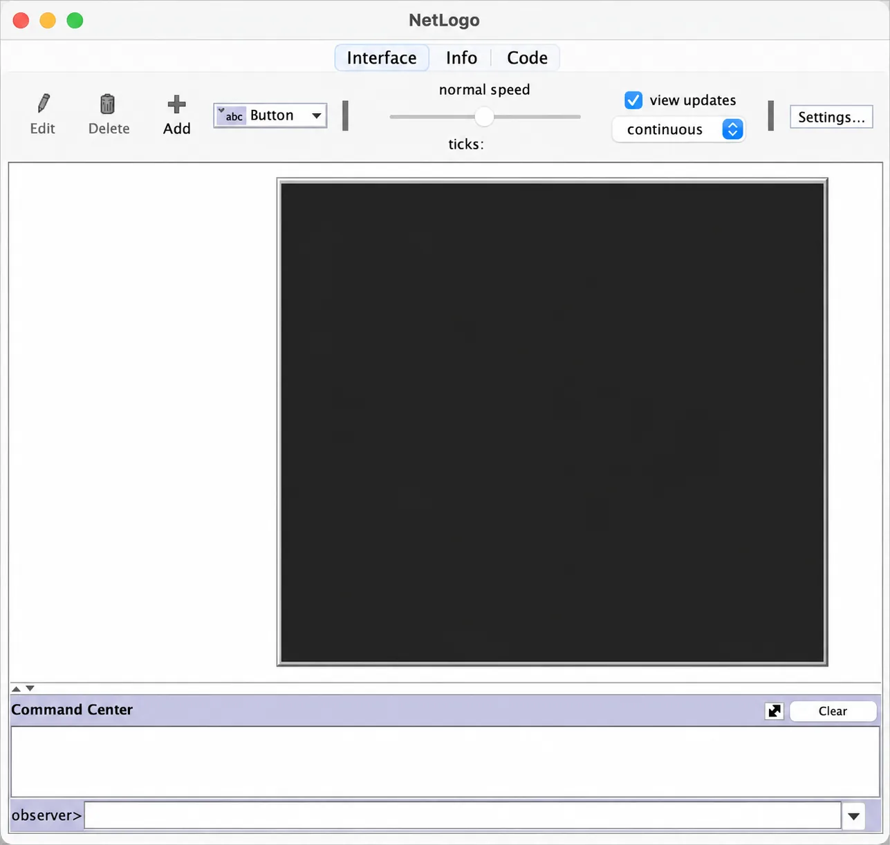
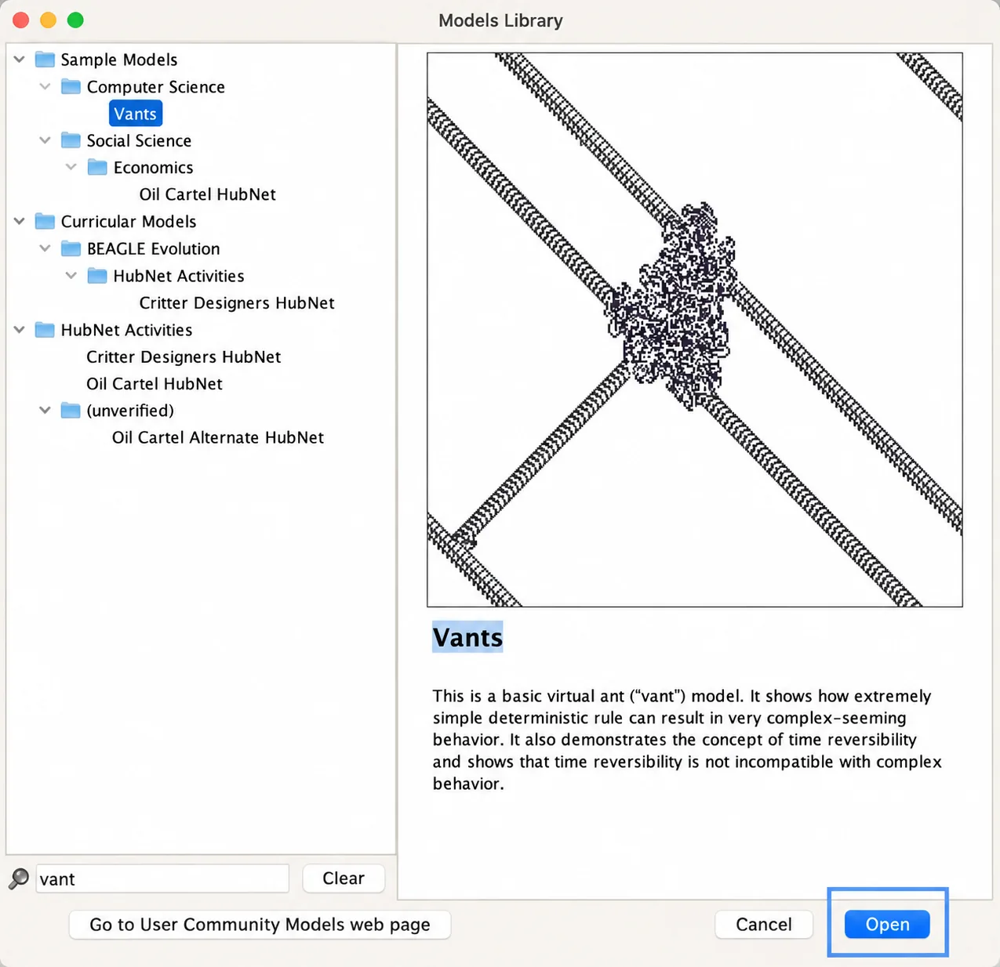
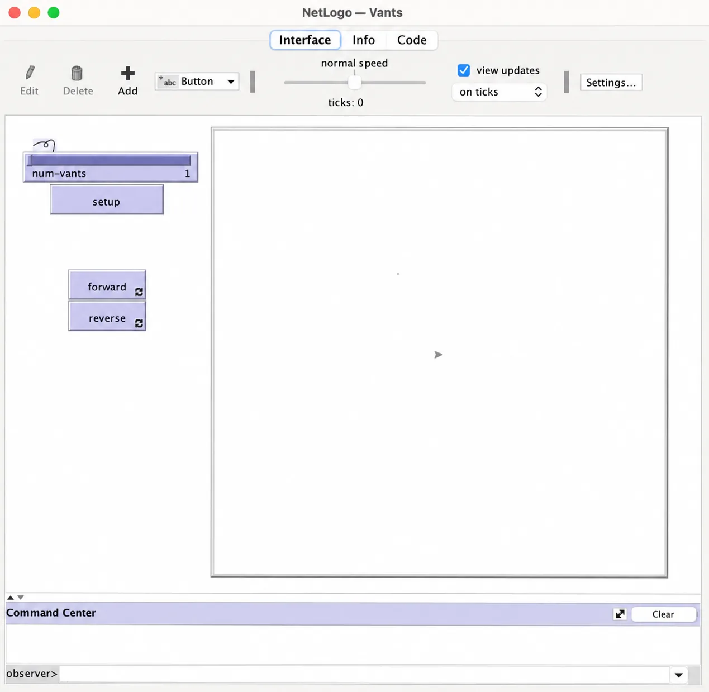
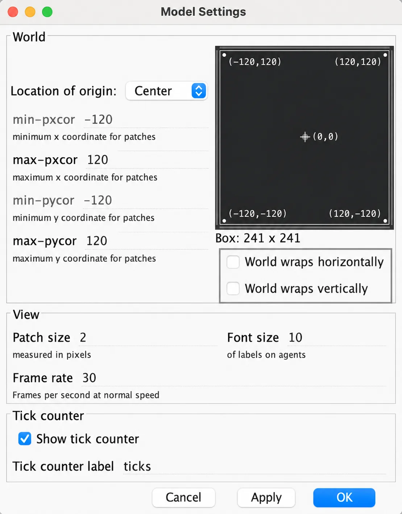
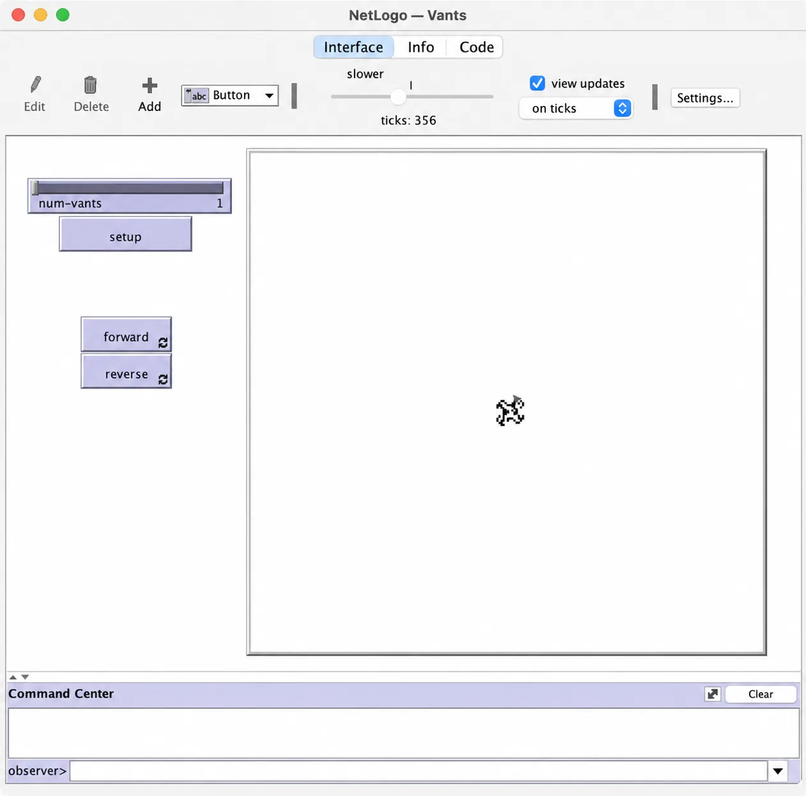
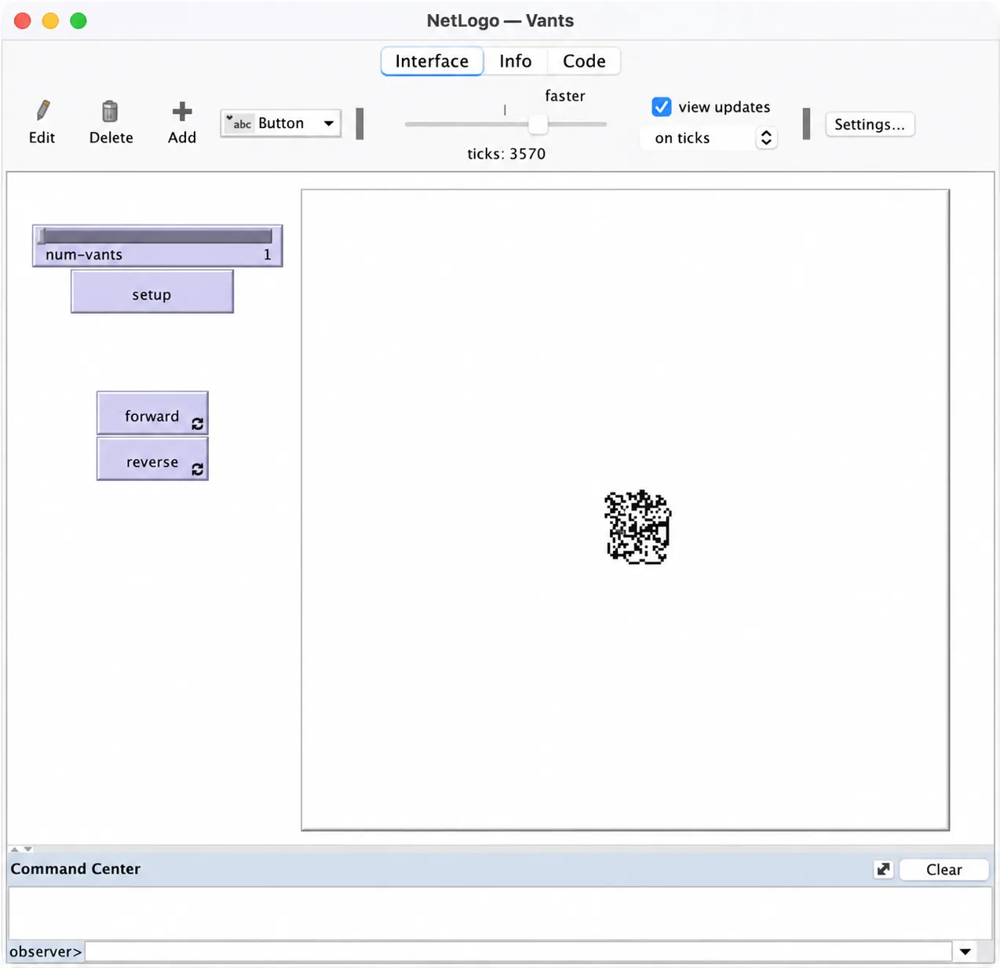
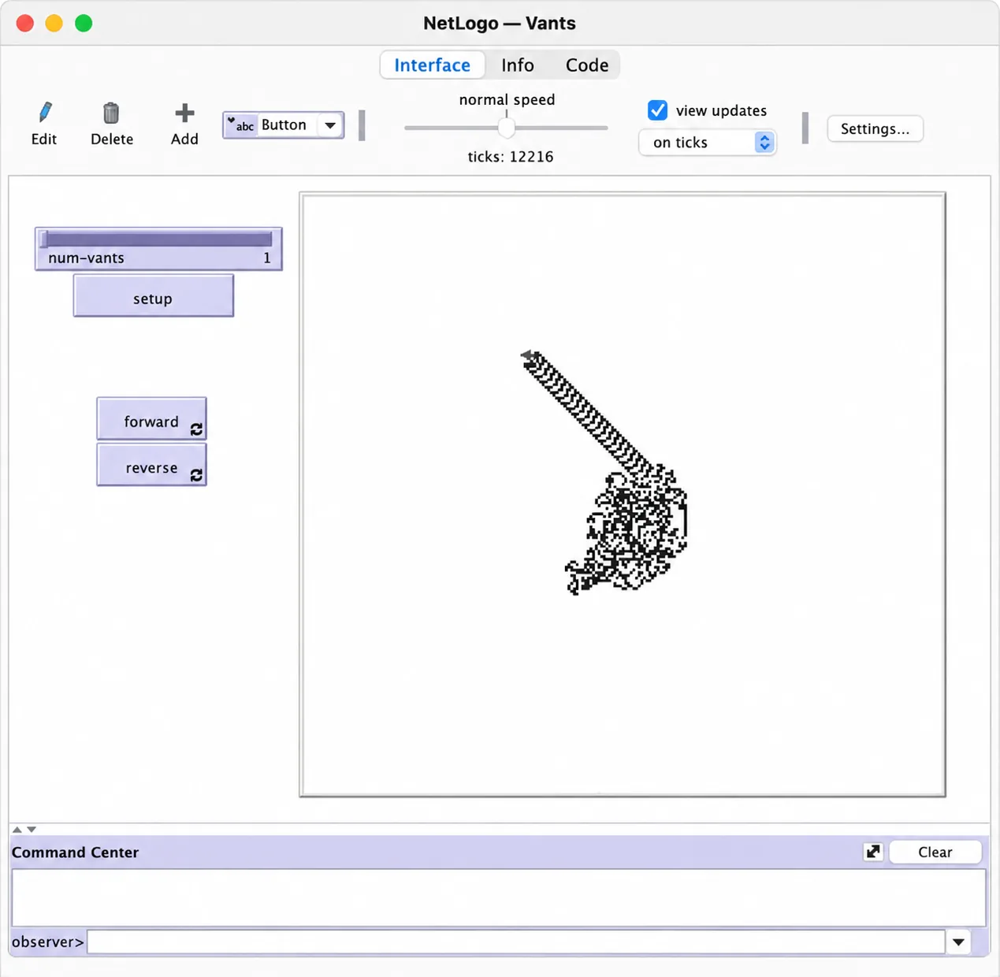

# 3.2 发展

因果分析之中，“时间”这个被人类文明忽视了几千年的因素，一直在发挥着神秘甚至神奇的作用。一经发现，我们才意识到，在过往的时间里，我们的思考是多么的狭隘。幸亏人类造出了计算机，可以帮助人类做过去无数人耗尽终生都“算”不完的工作，以至于一个新的学科在20世纪80年代兴起了——复杂性科学（Science of Complexity），专门研究复杂系统（Complex Systems）。事实上，我们一直都活在复杂系统之中，因为世界就是一个复杂系统，这个复杂系统里面的几乎每样东西也是复杂系统，比如我们的人体，以及包括在我们人体之内的大脑。

科学家的伟大之处在于，他们中的一部分人在完成复杂且艰辛的研究之后，还会做科普，用通俗易懂的方式向大众普及研究成果。复杂性科学的核心也很容易说清楚：

> 极为简单的要素和规则，经过大量的迭代，就可能涌现出原本不可想象的复杂结果——这个过程，就是发展的过程。发展常常并没有尽头，而在这个过程中，时间是发展的唯一路径。

——请注意这几个关键词：简单、迭代、涌现、不可想象、复杂、发展、时间。

在继续后面的学习之前，需要你在电脑上安装一个软件——NetLogo，这是一个基于代理人的整合开发环境（Agent-based Programing IDE）。下载地址是：

> https://ccl.northwestern.edu/netlogo/download.shtml

别担心！我不是想让你写代码，只是需要你点点鼠标，运行一个程序，观察程序的执行结果。

*图3.2-1是NetLogo第一次运行的画面，看起来很简陋。*

*图3.2-1*

在程序的菜单中找到 “File → Models Library”，会跳出一个对话框，在左下角的搜索框里输入 “Vant”，接着在对话框左侧的列表中选择 “Sample Models → Computer Science → Vants”，如图3.2-2所示。然后点击对话框右下角的 “Open” 按钮。

*图3.2-2*

在 NetLogo 主窗口里，这个叫作 Vant 的模型就被打开了，如图3.2-3所示：

*图3.2-3*

先点击一下右上角的 “Settings” 按钮，取消选择 “World wraps horizontally” 和 “World wraps vertically”，如图3.2-4所示。然后点击 “OK” 按钮关闭对话框。

*图3.2-4*

点击一下程序界面左侧的“setup”按钮，再点击一下“forward”按钮，看看会发生什么。另外，程序界面的上侧有一个滑块可以让你在程序执行过程中随时调整执行步骤的更新速度。

这个模型的全称是兰顿蚂蚁（Langton's Ant），是一个通用图灵机，由克里斯托夫·兰顿（Christopher Langton）于1986年提出，于2000年被证明为“图灵完备”。

在一个无限大的平面棋盘中（NetLogo 里模拟的是 50×50 的棋盘），在任意一个格子里放一只想象中的蚂蚁，这只蚂蚁只能选择上下左右四个方向之一，依照以下两条极为简单的规则移动：

如果它在白色格子里，就将格子变成黑色，而后右转，前行一步。

如果它在黑色的格子里的话，就将格子变成白色，而后左转，前行一步。

规则如此简单，然后会发生什么呢？接下来的发展分为三个阶段：

简单阶段：在最初的几百步里，蚂蚁的足迹会形成非常简单的对称图形。如图3.2-5：

*图3.2-5*

混沌阶段：几百步之后，逐渐形成毫无规则可言的随机图形。如图3.2-6：

*图3.2-6*

秩序阶段：大约在一万步之后，“秩序”突然涌现。蚂蚁的足迹会显现一个由104步构成的图形（被网友戏称为“高速公路”），永不停歇。如图3.2-7：

*图3.2-7*

重新点一下 “setup” 按钮可以恢复到起始状态，而后再次重新开始。每一次，“高速公路”的方向都可能不一样，但无论如何，蚂蚁都会最终朝着一个方向驰骋——虽然从蚂蚁的视角看，每时每刻它都只是在绕圈子。

重新回顾那几个关键词：简单、迭代、涌现、不可想象、复杂、发展、时间。而后在重复执行这个模型的过程里，反复体会这几个关键词。

我们当然可以说，只因最初那两个极其简单的规则，经过足够长的时间之后，蚂蚁终于找到了自己的方向。但真正的关键在于，谁都无法在一开始就精确预测到长时间迭代之后涌现出的结果。这就好像谁都无法提前想象地球上的生命从那么简单的单细胞生物开始，仅靠分裂、复制、变异这三个规则，在随后的几十亿年陆续涌现出那么多千奇百怪的物种。
