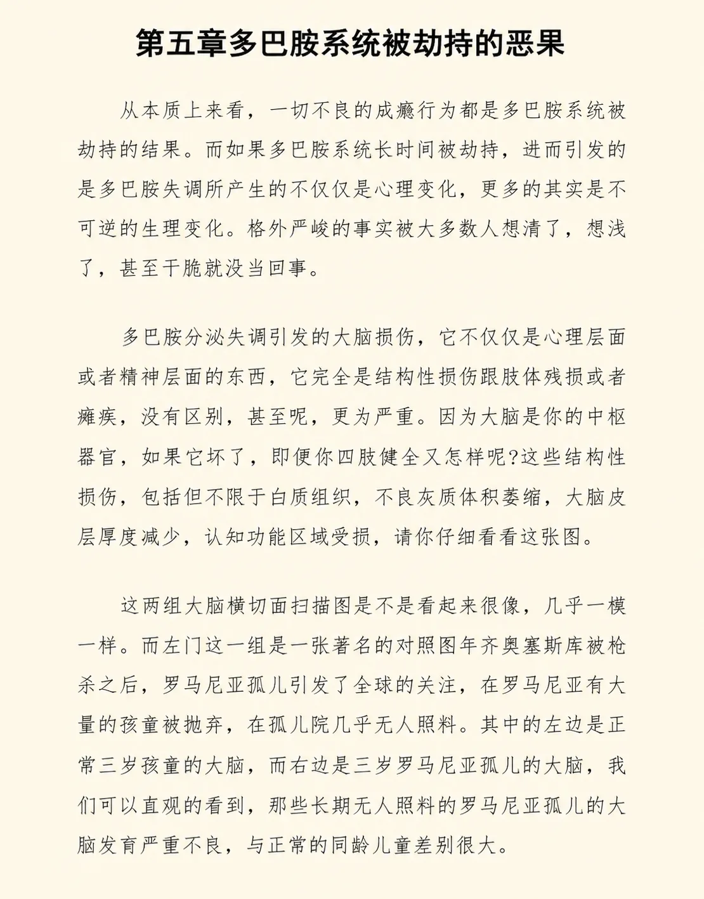

# 第五章 多巴胺系统被劫持的恶果

从本质上来看，一切不良的成瘾行为都是多巴胺系统被劫持的结果。而如果多巴胺系统长时间被劫持，进而引发的多巴胺失调，所产生的就不仅仅是心理变化，更多的其实是不可逆的生理变化。这个格外严峻的事实，被大多数人想少了，想浅了，甚至干脆就没当回事。

多巴胺分泌失调引发的大脑损伤，它不仅仅是心理层面或者精神层面的东西，它完全是结构性损伤，跟肢体残损或者瘫痪没有区别，甚至呢，更为严重。因为大脑是你的中枢器官，如果它坏了，即便你四肢健全又怎样呢？这些结构性损伤，包括但不限于白质组织不良、灰质体积萎缩、大脑皮层厚度减少、认知功能区域受损，请你仔细看看这张图。

*大脑横切面扫描对照*

这两组大脑横切面扫描图是不是看起来很像，几乎一模一样。而左面这一组是一张著名的对照图：1989 年齐奥塞斯库被枪杀之后，罗马尼亚孤儿引发了全球的关注，在罗马尼亚有大量的孩童被抛弃，在孤儿院几乎无人照料。其中的左边是正常三岁孩童的大脑，而右边是三岁罗马尼亚孤儿的大脑，我们可以直观地看到，那些长期无人照料的罗马尼亚孤儿的大脑发育严重不良，与正常的同龄儿童差别很大。

连体积差异都很大。而右面那一组是同一个人大脑的横切面扫描图，是一个短视频成瘾者每天刷短视频超过六小时、连续三年之后的对照。请注意，每天刷六个小时并不是罕见的，相反是今天很常见的短视频平台使用时长，人们通常在若干个短视频平台之间反复切换。右面一组看起来非常惊人，仅仅三年的时间，虽然表面上还是同一个人，没有缺胳膊，没有少腿，但他的大脑结构却发生了很大的变化，乃至于一个正常人，仅仅三年之后就变成了罗马尼亚孤儿似的。核心就在于这里：我们自己的大脑是一个内部器官，是自己看不见、摸不着、甚至无从体验或者观察的东西。

它要是受伤了，我们自己并不知道，甚至无从知晓，这跟我们摔倒了骨折是不一样的。它不会让你一身冷汗，不会疼到晕厥，不会惊慌失措，甚至你不知道应该如何应对，也没有什么医生可以帮忙诊断或者提供治疗方案。极为可怕的地方在于，这不是什么坏习惯而已的东西，这是重症，并且还是绝症。虽然大脑有一定的可塑性，但过了一定的程度，就只能是不可逆了，没有办法。

这不是表面的问题，是大脑结构发生了变化，受到了损伤，没有任何办法可逆，只不过是绝大多数对此完全无知的人，无论如何都分辨不出差异而已。你仔细想想，看吧，哪一个多巴胺系统被劫持的人，竟然会觉得自己已经残疾了？他能吃能睡，能说话，不疼不痒，不难受，这怎么可能是所谓的病了呢？

是不是？与此同时呢，他们用他们自己并不知道已经发生了结构变化、或者其实应该被称为结构损伤的那个大脑，去感知自己和周遭的世界，于是进而引发了很多精神层面、心理层面上的相关扭曲。我们之前提到过，多巴胺系统被劫持，不是因为最近几年的短视频平台出现才出现的，历史上电视的崛起、数字媒体的崛起、社交网络的崛起、短视频平台的崛起，带来的是一浪又高过一浪的多巴胺介质。

它们比黄赌毒更为可怕的地方，在于它们更加隐蔽，人们对它们的认知也更加肤浅，甚至干脆完全无知，所以也就全无防备。而受害者不仅包括成年人，也包括更容易受伤的幼童和青少年，更包括广大中老年人。你只要稍微留意一下你自己的亲戚群，看看那些老年人整天在看什么、在转什么，就知道个大概了。如果你之前没有听说过，不妨到网上搜两个网红的名称，一个叫秀才，一个叫一笑倾城。

前者是中老年女性杀手，后者是中老年男性杀手。让我们继续下去，先看看一组数据。目前人群当中的 ADHD 患者，即所谓的多动症，是一种注意力缺乏的典型病症。这种 ADHD 患者越来越多，他们的比例在不断地提高。

根据美国疾病控制和预防中心的数据，被诊断为 ADHD（多动症）的儿童的比例在过去这些年里持续攀升。从时段上来看呢，这个时段正是互联网崛起和移动互联网崛起的过程期间。也就是说，ADHD 病例每年都在以相当可观的幅度增加。另一项分析表明，美国各个年龄段儿童的多动症发病率都有明显上升，而青少年的多动症发病率上升得更是惊人。ADHD、抑郁症甚至帕金森症，这类疾病再往下深入，从大脑的本质上来看，都有同样的一个特征，或者说同样的根源，其实都是注意力功能受损，或者是注意力功能缺失。

心理学家们现在用注意广度，即所谓的 attention span，去衡量一个人集中注意力的能力。更为可怕的是，日益增加的屏幕数量，而且都是永远在线的。你看看我自己，现在有一大一小两个苹果手机，家里还有一个用来当做遥控器和门卡的安卓手机，因为苹果手机不支持红外、不支持 NFC 嘛；我还有一个 iPad、一个苹果笔记本电脑、两个苹果台式机，其中一个台式机还外接了第二块显示器；客厅、卧室、工作室各有一台大屏幕索尼电视，这就林林总总加起来总计一大堆屏幕了。如果我出门开车的时候，那特斯拉的中控还是一个大屏幕。实际上这并不是我一个人的特殊情况，今天绝大多数人都是如此。不知不觉之间，也几乎是瞬间，我们面对的屏幕数量弄不好一下子增加了好几倍，甚至可能是十倍或者十倍以上。

更为严峻的是未成年人目前正在面临或者经历的情况，全球都是一样的。你别看短视频平台是从中国崛起的，可实际上，中国还的确是目前全球唯一一个立法限制未成年人屏幕时间的国家。继两年前中国立法限制未成年人的屏幕时间之后，中国再次公布了移动互联网未成年人模式建设指南征求意见稿。这多少引发了全球知识界的广泛羡慕，对吧？你可以参见 MIT 的科技要闻回顾。连成年人的多巴胺系统都很容易被永远在线的设备所劫持，更何况未成年人的多巴胺系统呢？未成年人的多巴胺系统甚至不用被劫持，因为他们的大脑皮层，即所谓的前额叶皮层，压根就没有发育完整。所以那些永远在线的设备，甚至不用炸毁控制回路，因为就没有控制回路，而是直接接管了欲望回路之后，就可以无限制地抑制控制回路的发展了。

很可怕。

对于成年人来说，多巴胺系统被劫持的结果完全是器质性损伤，即所谓的结构性损伤，相当于是物理设备损坏，而不仅仅是心理损伤。对未成年人来说呢，用器质性损伤或者结构性损伤这些词都无法描述得足够准确，因为损伤毕竟得有个前提，那就是之前还是完好的，于是对应着之后被损坏了，运气好还可以修复；但是未成年人之前就没有发育完整。

所以对未成年人来说，相当于是一栋楼还没建好，在建设过程当中就一直被破坏，甚至还在打地基的过程当中就已经在被破坏，还是在不知不觉之中被破坏得非常彻底的那种。

虽然身体还在长，毕竟现代社会很难有饿死谁的情况，但无论身体长成了什么样，大脑却从一开始就是烂尾楼。你把这种损伤称为损伤，实在不太恰当，因为这和天生残疾干脆没有多大区别。另外，你还记得那些在实验室里被累死的小老鼠吗？一切多巴胺系统被劫持的人都一样：爽感开始的时候会非常强烈，比较强烈，但很快就会逐步递减，直至很难再有什么爽感。也就是说，做了并不爽，但是不做就会非常难受。

比如吸毒者刚开始的时候会有很强烈的爽感，但没有多久就不再爽了，可是不吸的话就会越来越难受，到最后所谓的爽只是因为摆脱了难受才有的瞬间的解脱而已，临终的时候可比那些累死的小老鼠惨太多了。
